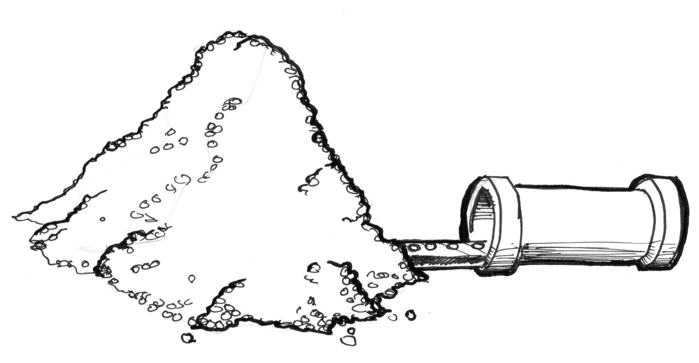

# Começando
## O que é um fragment shader?

No capítulo anterior descrevemos shaders como o equivalente dos avanços trazidos pela prensa de Gutenberg. Por que? E mais importante: o que é um shader?

Se você já tem experiência em desenhar em computadores, você sabe que nesse processo você desenha um círculo, depois um retângulo, uma linha, alguns triângulos até você finalmente compor a imagem desejada. O processo é muito similar a escrever uma carta ou livro à mão, um conjunto de instruções que executam uma tarefa atrás de outra.

Shaders são também um conjunto de instruções, mas as instruções são executadas todas ao mesmo tempo para cada pixel da tela. Isso significa que o código que você escreve têm que se comportar de maneira diferente, dependendo da posição do pixel na tela. Como uma prensa tipográfica, seu programa funcionará como uma função que recebe uma posição e retorna a respectiva cor, e, quando esse programa é compilado, ele será executado extraordinariamente rápido.

## Por que shaders são rápidos?

Para responder essa pergunta, eu apresento as maravilhas do *processamento paralelo*.

Imagine a CPU do seu computador como um grande tubo (ou ducto) industrial, e cada tarefa como algo que passa por ele - como uma linha de produção. Algumas tarefas são maiores que outras, o que signica que elas requerem mais tempo e energia que as outras. Digamos que elas requerem mais poder de processamento. Por causa da arquitetura dos computadores, as tarefas são forçadas a serem executadas em série; cada tarefa é finalizada uma de cada vez. Computadores modernos geralmente tem grupos de quatro processadores para trabalhar com tais tubos, completando as tarefas sequencialmente  e mantendo a linha de produção em movimento. Cada tubo é também conhecido como *thread*.

Video games e outras aplicações gráficas requerem muito mais poder de processamento que outros programas. Por causa de seu conteúdo gráfico, eles precisam fazer um número enorme de operações pixel-por-pixel. Cada pixel da tela precisa ser computado, e em jogos em 3D geometrias e perspectivas também precisam ser calculadas.

Vamos voltar para a nossa metáfora de tubos e tarefas. Cada pixel da tela representa uma tarefa pequena e simples. Individualmente, cada tarefa deste tipo não é um problema para o CPU, mas (e aqui mora o perigo) a pequena tarefa precisa ser repetida para cada pixel na tela! Isso significa que em uma tela antiga de 800x600, 480.000 pixels precisam ser processados pada cada frame, o que totaliza em 14.400.000 cálculos por segundo! Sim! Isso é um problema grande o suficiente para sobrecarregar um microprocessador. Em uma tela moderna com retina display medindo 2880x1800, executando a 60 frames por segundo, esse cálculo resulta em até 311.040.000 cálculos por segundo. Como engenheiros gráficos resolvem esse problema?

Neste caso, processamento em paralelo se torna uma boa solução. Em vez de ter alguns microprocessadores grandes e poderosos, ou *tubos*, é mais inteligente ter um monte de minúsculos microprocessadores rodando em paralelo ao mesmo tempo. Isso é o que a Unidade de Processamento Gráfico (Graphic Processor Unit ou GPU) é.

Imagine os minúsculos microprocessadores como uma mesa de tubos, e os dados de cada pixel como uma bola de ping-pong. 14.400.000 bolas de ping-pong por segundo podem obstruir quase qualquer tubo. Mas a mesa com 800x600 pequenos tubos recebendo 30 ondas de 480.000 pixels por segundo pode manejar esse fluxo tranquilamente. Funciona do mesmo jeito em resoluções maiores - quanto mais hardware em paralelo você tem, maior o fluxo que eles podem manejar.

Outro "super poder" da GPU são funções matemáticas especiais aceleradas via hardware, logo operações matemáticas mais complicadas são resolvidas diretamente pelos microchips em vez do software. Isso resulta em operações trigonométricas e matriciais extra rápidas - tão rápidas quanto a eletricidade.

## O que é GLSL?

GLSL é a sigla de openGL Shading Language, o que é o padrão específico de shader que você verá nos próximos capítulos. Existem outros tipos de shaders, dependendo do hardware ou sistemas operacionais. Aqui trabalharemos com as specificações do openGL, reguladas por [Khronos Group](https://www.khronos.org/opengl/). Entender a história do OpenGL pode ser útil se compreender a maior parte das estranhas convenções, para isso eu te recomendo a dar uma olhada em: [openglbook.com/chapter-0-preface-what-is-opengl.html](http://openglbook.com/chapter-0-preface-what-is-opengl.html)

## Por que shaders têm uma má reputação?

Como disse o Tio Ben “com grandes poderes vêm grandes responsabilidades” e computação em paralelo segue essa regra; o poderoso design aquitetônico da GPU vem com suas próprias limitações e restrições.

Para cada tubo - ou thread - ser executado em paralelo, eles têm que ser independentes de outras threads. Podemos dizer que threads são *cegas* com relação ao que as outras threads estão fazendo. Essa restrição faz com que todos os dados devem fluir na mesma direção. Deste modo é impossível checar o resultado de outra thread, modificar o input de dados ou passar o resultado de uma thread para outra. Permitir comunicação entre as threads coloca a integridade dos dados em risco.

Além disso, a GPU mantém os microprocessadores (os tubos) constantemente ocupados; assim que eles ficam livres eles recebem novas informações para serem processadas. É impossível para uma thread saber o que ela estava fazendo num momento anterior. Isso poderia ser desenhar um botão para a UI do sistema operacional, depois renderizar uma porção do céu em um jogo, seguido de mostrar o texto de um email. Cada thread não é só **cega** como **sem memória**. Apesar da abstração requerida para programar uma função genérica que muda o resultado pixel por pixel dependendo da posição do mesmo, as limitações desta cegueira e falta de memória faz com que os shaders não sejam muito populares entre programadores iniciantes.

Não se preocupe! Nos capítulos seguintes aprenderemos passo-a-passo a trabalhar com shaders com exemplos que vão de simples a avançados. Se você está lendo este livro em um navegador moderno, você pode poderá brincar com os exemplos interativos. Então clique em *Next >>* e mãos à obra!
