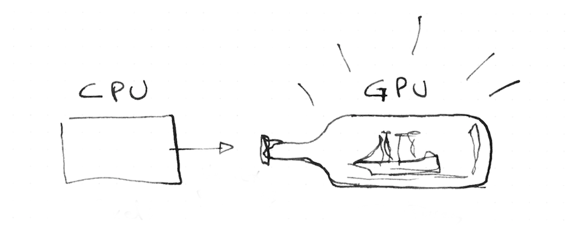

## Uniforms

Wir haben bereits gesehen, wie die GPU eine große Anzahl von parallelen Aufgaben (engl. *Threads*) verwaltet. Jeder Thread übernimmt die Berechnung des Farbwerts für einen Pixel, also für einen kleinen Teil der gesamten Grafik. Obwohl er dabei blind für die anderen Threads ist, muss es einen Weg geben, wie die CPU bestimmte Daten an alle Threads übermitteln kann. Aufgrund der Architektur einer Grafikkarte müssen diese Daten für alle ausgeführten Threads einheitlich (engl. *uniform*) und nur lesbar (engl. *read-only*) sein. Jeder Thread erhält also die gleichen Daten, die er nicht verändern kann. 

Man bezeichnet diese Daten deshalb als ```uniform```. Es gibt sie in den wichtigsten Datentypen, die GLSL unterstützt: ```float```, ```vec2```, ```vec3```, ```vec4```, ```mat2```, ```mat3```, ```mat4```, ```sampler2D``` und ```samplerCube```. Uniforms werden gemeinsam mit ihrem jeweiligen Datentyp am Anfang eines Shader-Programms definiert, sofern man darauf Bezug nehmen möchte. Dies geschieht in der Regel gleich nachdem man die gewünschte Genauigkeit für alle Fließkommaoperationen in dem Programm festgelegt hat.

```glsl
#ifdef GL_ES
precision mediump float;
#endif

uniform vec2 u_resolution; // Groesse der Malfläche (canvas) in Pixeln (Breite, Hoehe)
uniform vec2 u_mouse;      // Mausposition über der Malfleache in Pixeln (X, Y)
uniform float u_time;      // Zeit in Sekunden seit dem Start des Bildaufbaus
```

Man kann sich Uniforms als eine Brücke zwischen der CPU und der GPU vorstellen. Ihre Bezeichnung hängt von der jeweiligen Implementation der GLSL-Umgebung ab. Im Rahmen dieses Buches verwenden wir die folgenden Namen: ```u_time``` , ```u_resolution``` und ```u_mouse```. Wir folgen damit der Konvention, die Variablennamen jeweils mit dem Präfix ```u_``` beginnen zu lassen, damit sie im Programmcode deutlich als Uniforms erkennbar sind. In anderen Umgebungen für die Entwicklung von Shadern tragen sie andere Namen, wie beispielsweise bei [ShaderToy.com](https://www.shadertoy.com/). Dort heißt es:

```glsl
uniform vec3 iResolution;   // Groesse der Malflaeche
uniform vec4 iMouse;        // Mausposition
uniform float iGlobalTime;  // Zeit seit dem Start
```

Aber nun genug geredet. Lass uns die Uniforms in Aktion betrachten. Der folgende Programmcode nutzt ```u_time``` - die Anzahl der Sekunden, seitdem der Shader gestartet wurde - in Verbindung mit einer Sinus-Funktion, um die Intensität der Rotfärbung der Malfläche pulsieren zu lassen.

<div class="codeAndCanvas" data="time.frag"></div>

Wie Du siehst, hält GLSL noch einige Überraschungen bereit. Die GPU unterstützt in der Hardware realisierte Winkel-, Trigonometrie- und Exponential-Funktionen. Hier einige dieser Funktionen im Überblick: [```sin()```](../glossary/?search=sin), [```cos()```](../glossary/?search=cos), [```tan()```](../glossary/?search=tan), [```asin()```](../glossary/?search=asin), [```acos()```](../glossary/?search=acos), [```atan()```](../glossary/?search=atan), [```pow()```](../glossary/?search=pow), [```exp()```](../glossary/?search=exp), [```log()```](../glossary/?search=log), [```sqrt()```](../glossary/?search=sqrt), [```abs()```](../glossary/?search=abs), [```sign()```](../glossary/?search=sign), [```floor()```](../glossary/?search=floor), [```ceil()```](../glossary/?search=ceil), [```fract()```](../glossary/?search=fract), [```mod()```](../glossary/?search=mod), [```min()```](../glossary/?search=min), [```max()```](../glossary/?search=max) sowie [```clamp()```](../glossary/?search=clamp).

Nun ist es an der Zeit, mit dem obigen Shader zu experimentieren.

* Versuche, die Frequenz zu verlangsamen, mit der sich die Rotfärbung ändert, bis dieser Prozess kaum noch wahrnehmbar ist.

* Beschleunige die Frequenz, bis man fast nur noch eine Farbe sieht.

* Experimentiere mit periodischen Änderungen auch in den anderen Farbkanälen (Grün und Blau), so dass sich interessante Farbspiele und Muster ergeben.

## gl_FragCoord

So, wie GLSL das Resultat eines Shader-Durchlaufs standardmäßig in der Variable ```vec4 gl_FragColor``` erwartet, liefert es uns auch standardmäßig einen Eingabewert: Die Koordinate des jeweils zu bearbeitenden Bildpunkts in der Variable ```vec4 gl_FragCoord```. Im Englischen spricht man in diesem Zusammenhang auch von einem *screen fragment*. Diese Variable kann man nicht als ```uniform``` bezeichnen, weil ihr Inhalt bzw. Wert mit jedem Shader-Durchlauf variiert. Man spricht deshalb auch von einem *varying*.

<div class="codeAndCanvas" data="space.frag"></div>

Im obigen Programmcode *normalisieren* wir zunächst die Koordinate des zu bearbeitenden Fragments, indem wir sie durch die Auflösung der Zeichenfläche teilen. Auf diese Weise bilden wir die *X-* und *Y-Ordinate* jeweils auf den Wertebereich zwischen ```0.0``` und ```1.0``` ab. Das erleichtert es uns, diese Ordinaten auf Farbwerte für den Rot- und den Grün-Kanal zu übertragen. Schließlich müssen sich diese auch immer jeweils zwischen ```0.0``` und ```1.0``` bewegen.

In der Welt der Shader-Programmierung haben wir nicht so viele Möglichkeiten zum Debugging, abgesehen davon, dass wir dem gerade berechneten Bildpunkt intensive Farbtöne zuweisen können. Das entstehende Bild lässt dann Rückschlüsse auf die Abläufe innerhalb des Shaders zu. Du wirst im Laufe dieses Buches entdecken, dass die Shader-Programmierung manchmal dem Versuch gleicht, ein Modellschiff in eine Flasche zu pressen. Denn das ist gleichermaßen schwierig, aber auch schön anzusehen und in jedem Fall lohnend.



Jetzt ist es an der Zeit für eine kleine Herausforderung in Bezug auf das Verständnis des obigen Programmcodes. 

* Kannst du ausmachen, wo sich die Koordinate ```(0.0,0.0)``` innerhalb unserer Zeichenfläche befindet?

* Und wo liegen wohl die Koordinaten ```(1.0,0.0)```, ```(0.0,1.0)```, ```(0.5,0.5)``` und ```(1.0,1.0)```? Die Farben der jeweiligen Bildpunkte verraten es Dir!

* Gelingt es Dir, die aktuelle Mausposition aus dem Uniform ```u_mouse``` einzubeziehen? Denke daran, dass sich die Angaben in dieser Uniform auf Pixel beziehen und zunächst nicht normalisiert sind. Kannst Du den Programmcode so gestalten, dass die erzeugten Farben auf die Mausbewegung reagieren? 

* Fällt Dir ein Weg ein, wie man die Farbgestaltung auf interessante Weise durch die Einbeziehung von ```u_time``` und ```u_mouse``` dynamisieren kann?

Nach all diesen Übungen fragst Du Dich vielleicht, wo Du Deine neuen Shader-Kenntnisse sonst noch ausprobieren kannst. Im folgenden Kapitel zeigen wir, wie man Shader in *three.js*, *Processing* und *openFrameworks* zum Laufen bringt.
