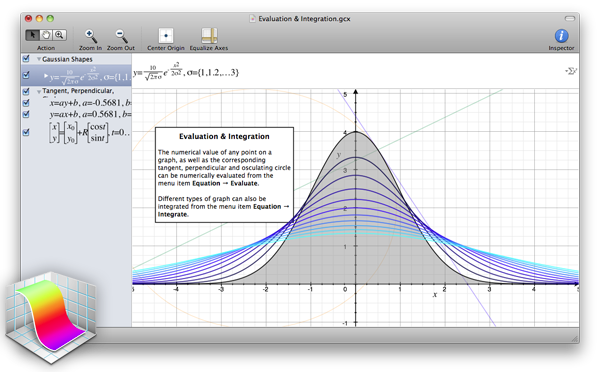

# Algoritmos de desenho
## Modelagem de funções

Este capítulo poderia se chamar "Lição de pintar a cerca com o Sr. Miyagi". Anteriormente, nós mapeamos as posições normalizadas de *x* e *y* para os canais *red* e *green*. Essencialmente, nós criamos uma função que recebe um vetor bidimensional (x e y) e retornamos um com quatro dimensões (vermelho, verde, azul e alpha). Mas antes de irmos além de transformações dos dados entre as dimensões, precisamos fazer algo mais simples... muito mais simples: entender como criar uma função unidimensional. Quanto mais energia e tempo que você gastar dominando isso, mais forte seu karatê de shader será.


A estrutura do código a seguir será nossa cerca. Nela, nós visualizaremos os valores normalizados da coordenada *x*  (`st.x`) de dois jeitos: uma com a claridade (observe o belo gradiente de branco para preto) e a outra é traçando uma linha verde por cima (neste caso, o valor de *x* será atribuído diretamente a *y*). Não foque tanto na função de traçar, nós a veremos com mais detalhes em alguns minutos.

<div class="codeAndCanvas" data="linear.frag"></div>

**Nota rápida**: O construtor do tipo `vec3` "entende" que você quer atribuir o mesmo valor aos três canais de cores, enquanto `vec4` entende que você quer construir um vetor quadridimensional usando um vetor tridimensional e também um quarto valor (neste caso, o valor que controlará o alpha ou opacidade). Veja as linhas 20 e 26 acima por exemplo.

Este código é a sua cerca: É importante observar e entendê-lo. Você voltará algumas vezes para este espaço entre *0.0* e *1.0*. Aprenderá a arte de mesclar e dar forma a esta linha.

Essa relação de um pra um entre *x* e *y* (ou de brilho) é conhecida como *interpolação linear*. A partir daqui, nós usaremos algumas funções matemáticas para dar *forma* a linha. Por exemplo, nós podemos elevar *x* à quinta potência para criar uma linha *curvada*.

<div class="codeAndCanvas" data="expo.frag"></div>

Interessante, não é? Na linha 22, tente diferentes expoentes: 20.0. 2.0, 1.0, 0.0, 0.2 e 0.02 por exemplo. Entender essa relação entre o valor e o expoente será de grande ajuda. Usar esses tipos de funções matemáticas aqui e ali nos dará um controle significativo do nosso código, uma espécie de acumpultura de dados que permite que você controle a fluência dos valores.

[`pow()`](../glossary/?search=pow)  é uma função nativa no GLSL e existem muitas outras. A maioria delas são aceleradas em nível de hardware, o que significa que se elas forem usadas da forma certa e com juízo, farão seu código mais rápido.

Substitua a função de potência na linha 22. Tente outras como: [`exp()`](../glossary/?search=exp), [`log()`](../glossary/?search=log) e [`sqrt()`](../glossary/?search=sqrt). Algumas destas funções são mais interessantes quando você experimenta utilizando PI. Você pode ver na linha 8 que eu defini uma macro que retornará qualquer chamada de `PI` com o valor de `3.14159265359`.

### Step e smoothstep

GLSL também tem algumas exclusivas funções nativas de interpolação que são aceleradas pelo hardware.

A interpolação [`step()`](../glossary/?search=step) recebe dois parâmetros. O primeiro é para o limite ou limiar, enquanto o segundo é o valor que nós queremos passar.  Qualquer valor abaixo do limite retornará `0.0` e qualquer um acima do limite retornará `1.0`.

Experimente mudar este valor de limiar na linha 20 do código a seguir.

<div class="codeAndCanvas" data="step.frag"></div>

A outra função exclusiva é conhecida como [`smoothstep()`](../glossary/?search=smoothstep). Dado um intervalo de dois números, está função irá interpolar os valores entre o intervalo definido. Os dois primeiros parâmetros são para o início e o final da transição, enquanto o terceiro é o valor que será interpolado.

<div class="codeAndCanvas" data="smoothstep.frag"></div>

No exemplo anterior, na linha 12, veja que estamos usando smoothstep para desenhar a linha verde na função `plot()`. Para cada posição dentro do eixo *x*, esta função faz uma *marcação* num valor específico de *y*. Como? Conectando duas [`smoothstep()`](../glossary/?search=smoothstep) juntas. Dê uma olhada na seguinte função, troque a linha 20 acima por esta, e imagine-a como um corte vertical. O fundo se parece com uma linha, certo?

```glsl
float y = smoothstep(0.2,0.5,st.x) - smoothstep(0.5,0.8,st.x);
```

### Seno e Cosseno

Quando queremos usar um pouco de matemática para animar, dar forma e mesclar valores, não há nada melhor que ser amigo do seno e cosseno.

Essas duas funções trigonométricas básicas trabalham juntas para construir circunferências que são tão úteis como o canivete suíço de MacGyver. É importante entender como elas se comportam e de quais formas elas podem ser combinadas. Em poucas palavras, dado um ângulo (em radianos), elas retornarão a posição correta de *x* ([cosseno](../glossary/?search=cos)) e *y* ([seno](../glossary/?search=sin)) de um ponto na linha de uma circunferência de raio igual a 1. O fato de elas retornarem valores normalizados (que vão de 1 a -1) de maneira suave faz delas, ferramentas incríveis.


Enquanto é difícil descrever todas as relações entre as funções trigonométricas e circunferências, a animação acima faz um ótimo trabalho em exemplificar visualmente esta relação.

<div class="simpleFunction" data="y = sin(x);"></div>

Preste muita atenção nesta onda de seno. Note como o valor de *y* flui suavemente entre +1 e -1. Como vimos nos exemplos de tempo no capítulo anterior, podemos usar esse movimento rítmico do [`sin()`](../glossary/?search=sin) para animar propriedades. Se você estiver lendo este exemplo em um navegador, você verá que você pode alterar o código da fórmula acima para observar como as ondas mudam. (Nota: não se esqueça do ponto e vírgula no final das linhas).

Experimente com os seguintes exercícios e veja o que acontece:

* Some o tempo (`u_time`) ao *x* antes de calcular o `sin`. Perceba o **movimento** ao longo de *x*

* Multiplique *x* por `PI` antes de calcular o `sin`. Veja como a **frequência** entre as fases se torna mais comprimida.

* Multiplique *x* pelo tempo (`u_time`) antes de calcular o `sin`.  Note que u_time já pode ter se tornado um valor muito grande, o que torna difícil enxergar a linha verde.

* Some 1.0 a [`sin(x)`](../glossary/?search=sin). Veja como toda a onda foi **deslocada** para cima e agora seus valores vão de 0.0 a 2.0.

* Multiplique [`sin(x)`](../glossary/?search=sin) por 2.0. Veja como a **amplitude** dobra seu tamanho.

* Calcule o valor absoluto ([`abs()`](../glossary/?search=abs)) do `sin(x)`. Se parece com o rastro de uma *bola quicando*.

* Extraia apenas a parte fracionária ([`fract()`](../glossary/?search=fract)) do resultante do [`sin(x)`](../glossary/?search=sin).

* Some o número inteiro mais alto ([`ceil()`](../glossary/?search=ceil)) e o inteiro mais baixo ([`floor()`](../glossary/?search=floor)) do resultante do [`sin(x)`](../glossary/?search=sin) para conseguir uma onda digital de 1 e -1.

### Outras funções úteis

No final do último exercício nós apresentamos algumas novas funções. Agora é hora de experimentar cada uma descomentando as linhas abaixo, uma de cada vez. É importante entender o funcionamento e comportamento destas funções. Eu sei, você deve estar se perguntando... Por quê? Uma rápida pesquisa no google de "arte generativa" (ou generative art) te mostrará. Lembre-se que estas funções são a nossa cerca. Nós estamos dominando o movimento em uma dimensão, para cima e para baixo. Logo, usaremos duas, três quatro dimensões!


<div class="simpleFunction" data="y = mod(x,0.5); // return x modulo of 0.5
//y = fract(x); // return only the fraction part of a number
//y = ceil(x);  // nearest integer that is greater than or equal to x
//y = floor(x); // nearest integer less than or equal to x
//y = sign(x);  // extract the sign of x
//y = abs(x);   // return the absolute value of x
//y = clamp(x,0.0,1.0); // constrain x to lie between 0.0 and 1.0
//y = min(0.0,x);   // return the lesser of x and 0.0
//y = max(0.0,x);   // return the greater of x and 0.0 "></div>

### Modelando funções avançadas

[Golan Levin](http://www.flong.com/) tem uma ótima documentação de modelagem de funções complexas que são de extraordinária ajuda. Portá-las para GLSL é uma excelente forma para começar seu próprio banco de trechos de códigos.

* [Polynomial Shaping Functions: www.flong.com/texts/code/shapers_poly](http://www.flong.com/texts/code/shapers_poly/)

* [Exponential Shaping Functions: www.flong.com/texts/code/shapers_exp](http://www.flong.com/texts/code/shapers_exp/)

* [Circular & Elliptical Shaping Functions: www.flong.com/texts/code/shapers_circ](http://www.flong.com/texts/code/shapers_circ/)

* [Bezier and Other Parametric Shaping Functions: www.flong.com/texts/code/shapers_bez](http://www.flong.com/texts/code/shapers_bez/)

<div class="glslGallery" data="160414041542,160414041933,160414041756" data-properties="clickRun:editor,hoverPreview:false"></div>

Como chefs que coletam temperos e ingredientes exóticos, artistas digitais e programadores criativos tem um amor único por trabalhar nas suas próprias funções.

[Iñigo Quiles](http://www.iquilezles.org/) tem uma grande coleção de [funções úteis](http://www.iquilezles.org/www/articles/functions/functions.htm). Depois de ler [este artigo](http://www.iquilezles.org/www/articles/functions/functions.htm), dê uma olhada na seguinte na seguinte tradução destas funções para GLSL. Preste atenção nas pequenas mudanças necessárias, como colocar o "." (ponto) nos números de ponto flutuantes ou usar o nome em GLSL para as *Funções em C*; por exemplo, em vez de `powf()`, usamos `pow()`:

<div class="glslGallery" data="05/impulse,05/cubicpulse,05/expo,05/expstep,05/parabola,05/pcurve" data-properties="clickRun:editor,hoverPreview:false"></div>

Para mantermos sua motivação lá em cima, aqui temos um exemplo elegante (feito por [Danguafer](https://www.shadertoy.com/user/Danguafer)) em masterizar o karatê das funções.

<iframe width="800" height="450" frameborder="0" src="https://www.shadertoy.com/embed/XsXXDn?gui=true&t=10&paused=true" allowfullscreen></iframe>

No *Próximo >>* capítulo, nós começaremos a usar nossos novos movimentos. Primeiro misturando cores e em seguida, desenhando formas.

#### Exercício

Dê uma olhada na seguinte tabela de equações feita por [Kynd](http://www.kynd.info/log/). Veja como ele está combinando as funções e suas propriedades para controlar os valores entre 0.0 e 1.0. Agora é a hora de você praticar replicando estas funções. Lembre-se que quanto mais você praticar, melhor será o seu karatê de shaders.


#### Para sua caixa de ferramentas

Aqui temos algumas ferramentas que facilitarão a visualização destes tipos de funções.

* Grapher: Se você estiver em um MacOS, digite `grapher` no sua Busca Spotlight e você poderá usar essa ferramenta super conveniente.



* [GraphToy](http://www.iquilezles.org/apps/graphtoy/): mais uma vez [Iñigo Quilez](http://www.iquilezles.org) fez uma ferramenta para visualizar funções em GLSL em WebGL.


* [Shadershop](http://tobyschachman.com/Shadershop/): esta surpreendente ferramenta criada por [Toby Schachman](http://tobyschachman.com/) lhe ensinará como construir funções complexas em uma forma inacreditavelmente visual e intuitiva.


