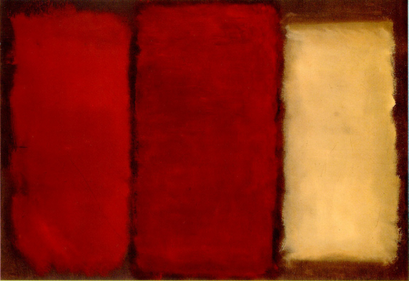
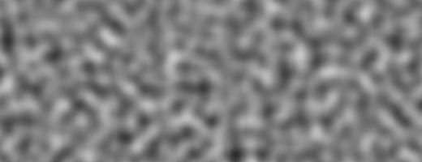
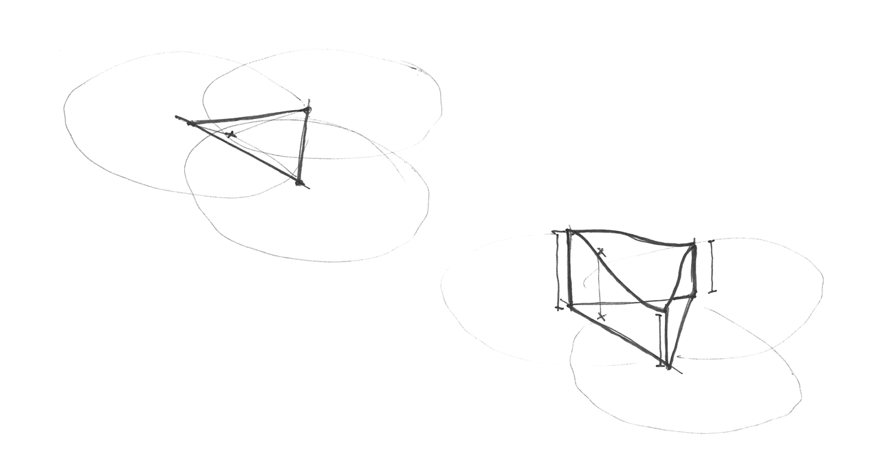
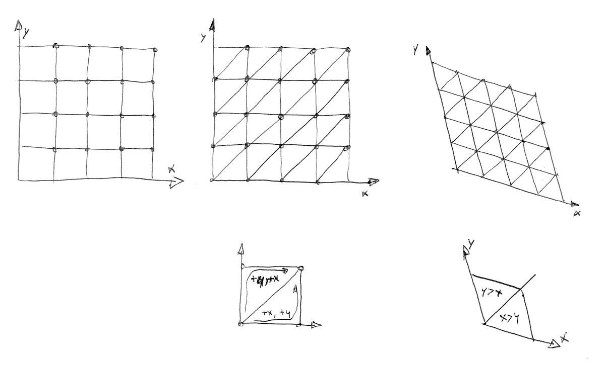

## Rauschen

Im letzten Kapitel haben wir mit Zufallsfunktionen gearbeitet, die wie weißes Rauschen auf dem Fernsehbildschirm wirkten. Nach so vielen Shader-Funktionen auf einmal dreht sich Dir bestimmt der Kopf und vielleicht sind auch Deine Augen etwas müde. Jetzt ist ein guter Moment, um einen kleinen Spaziergang zu unternehmen und ein wenig nach Luft zu schnappen.

Draußen im Freien spüren wir den Luftzug auf unserer Haut und die Sonne in unserem Gesicht. Die Welt ist ein so lebendiger und vielgestaltiger Ort voller Farben, Texturen und Klängen. Während wir uns in der Natur bewegen, können wir gar nicht anders, als die unterschiedlichen Oberflächen von Straßen, Gestein, Bäumen und Wolken wahrzunehmen. 


Die Unvorhersehbarkeit dieser Texturen könnte man als „zufällig“ auffassen. Dabei wirken sie so gar nicht wie die Zufallsstrukturen, mit denen wir uns im letzten Kapitel befasst haben. Die „echte Welt“ ist ein so komplexer Ort! Wir kann es uns gelingen, ihr Antlitz mit Hilfe von Algorithmen nachzuahmen?

Diese Frage beschäftigte [Ken Perlin](https://mrl.nyu.edu/~perlin/) in den frühen 1980er Jahren, als er den Auftrag erhielt, realistische Texturen für den Hollywood-Film „Tron“ zu erschaffen. Er entwickelte damals eine elegante Vorgehensweise, die als „Noise Algorithmus“ bekannt wurde und sogar einen Oskar erhielt (kein Witz).


Die folgende Funktion entspricht nicht dem klassischen Noise-Algorithmus von Perlin, aber sie ist ein guter Ausgangspunkt, um die Erzeugung „verrauschter“-Strukturen zu begreifen.

<div class="simpleFunction" data="
float i = floor(x);  // ganzzahliger Teil
float f = fract(x);  // Nachkommateil
y = rand(i); //rand() wurde im vorangegangenen Kapitel beschrieben
//y = mix(rand(i), rand(i + 1.0), f);
//y = mix(rand(i), rand(i + 1.0), smoothstep(0.,1.,f));
"></div>

In diesen Zeilen gehen wir ähnlich vor, wie im vorangegangenen Kapitel. Wir teilen eine fortlaufende Fließkommazahl (```x```) in ihren ganzzahligen Vorkommateil (```i```) und ihren Nachkommateil (```f```) auf. Wir nutzen dabei [```floor()```](.../glossary/?search=floor), um ```i``` zu erhalten, sowie [```fract()```](.../glossary/?search=fract) für die Berechnung von ```f```. Dann wenden wir ```rand()``` auf den ganzzahligen Teil von ```x``` an, wodurch wir für jede Ganzzahl eine einzigartige Zufallszahl erhalten.

Dahinter folgen zwei Programmzeilen, die zunächst auskommentiert sind. Die Erste davon interpoliert zwischen dem Zufallswert (```rand(i)```) und dem Zufallswert von (```rand(i+1)```) (also zwischen zwei ganz unterschiedlichen Zahlen) auf lineare Weise, wobei der Abstand für die Interpolation jeweils durch (```f```) bestimmt wird.

```glsl
y = mix(rand(i), rand(i + 1.0), f);
``` 

Fahre fort, indem Du die Kommentarzeichen für diese Zeile entfernst und Dir das Ergebnis anschaust.

An diesem Punkt unseres kleinen GLSL-Kurses wissen wir bereits, dass es noch etwas besseres als eine simple lineare Interpolation gibt, nicht wahr? Entferne deshalb die Kommentarzeichen aus der nächsten Zeile, die [```smoothstep()```](.../glossary/?search=smoothstep) nutzt, um bei der Interpolation weichere Verläufe und Übergänge zu erzielen.

```glsl
y = mix(rand(i), rand(i + 1.0), smoothstep(0.,1.,f));
```

Sobald Du die Kommentarzeichen aus dieser Zeile entfernt hast, erscheint ein anderes Ergebnis. In einigen Implementationen für Rausch-Funktionen verwenden die Autoren lieber ihre eigenen kubischen Kurven an Stelle von [```smoothstep()```](.../glossary/?search=smoothstep), wie etwa im folgenden Beispiel. 

```glsl
float u = f * f * (3.0 - 2.0 * f ); // kubische Verlaufskurve
y = mix(rand(i), rand(i + 1.0), u); // angewandt auf die Interpolation
```

Diese *sanfte Zufälligkeit* ist das entscheidende Merkmal, auf das es vielen Grafikkünstlern ankommt. Erst dadurch wird es möglich, geometrische Formen und Bilder zu erstellen, die so organisch wirken, als kämen sie direkt aus der Natur. Perlin's Noise-Algorithmus wurde seit seiner Veröffentlichung immer wieder in ganz unterschiedlichen Programmiersprachen und für verschiedene Dimensionen implementiert. Er hat Grafiker und Grafikkünstler auf der ganzen Welt bei ihren Arbeiten unterstützt.


Und nun bist Du dran:

* Entwickle Deine eigene ```float noise(float x)```-Funktion.

* Nutze Deine Noise-Funktion, um Formen zu animieren, indem Du sie bewegst, rotierst oder skalierst.

* Erstelle eine animierte Komposition aus mehreren Formen, die „miteinander“ tanzen, indem Du auf Noise-Funktionen zurückgreifst.

* Baue organisch-wirkende Formen mit Hilfe der Noise-Funktion.

* Sobald Du auf diese Weise eine eigene „Kreatur“ erschaffen hast, versuche ihr Lebendigkeit einzuhauchen, indem Du sie auf ganz charakteristische Weise bewegst.

## 2D-Rauschen


Jetzt, wo wir wissen, wie man Rauschen in einer Dimension erzeugt, können wir uns dem zweidimensionalen Rauschen zuwenden. Während wir im eindimensionalen Raum entlang einer Linie zwischen zwei Punkten (```fract(x)``` und ```fract(x)+1.0```) interpolieren, geschieht dies im zweidimensionalen Raum zwischen den vier Eckpunkten eines Vierecks innerhalb einer Ebene (```fract(st)```, ```fract(st)+vec2(1.,0.)```, ```fract(st)+vec2(0.,1.)``` und ```fract(st)+vec2(1.,1.)```).


In ähnlicher Weise müssen wir im dreidimensionalen Raum vorgehen. Hier sind es die acht Ecken eines Kubus, zwischen denen es zu interpolieren gilt. Dabei dreht sich alles um die Interpolation von Zufallswerten (engl. random values), weshalb man dabei auch in diesem Zusammenhang auch von **Value Noise** spricht.


Wie schon bei unserem Beispiel für den eindimensionalen Raum, erfolgt die Interpolation nicht linear, sondern kubisch, damit ein sanfter Verlauf zwischen allen Punkten des viereckigen Rasters entsteht.


Schau Dir die folgende Noise-Funktion an. 

<div class="codeAndCanvas" data="2d-noise.frag"></div>

Wir „blasen“ den Raum zunächst auf das Fünffache auf (*Programmzeile 45*), damit wir die Interpolation zwischen den einzelnen Elementen unseres Rasters besser erkennen können. Innerhalb der Noise-Funktion erfolgt dann die Einteilung des Raumes in einzelne Zellen. Wir speichern die Integer-Position der Zelle, ebenso den Nachkommateil für die Position innerhalb der Zelle. Die Integer-Position nutzen wir, um einen Zufallswert für alle vier Eckpunkte der Zelle zu erhalten (*Programmzeilen 23-26*). Schließlich interpolieren wir in *Programmzeile 35* zwischen den vier zufällig gewählten Eckpunkten auf Basis des Nachkommateils, den wir zuvor gespeichert haben.

Jetzt bist Du wieder dran. Versuche Dich an den folgenden Aufgaben:

* Ändere den Multiplikationsfaktor in *Programmezeile 45*. Versuche ihn zu animieren.

* Versuche herauszufinden, ab welcher Vergrößerungsstufe das Rauschen wieder vollkommen zufällig und unzusammenhängend (chaotisch) wirkt.

* Ab welcher Vergrößerungsstufe ist das Rauschen nicht mehr wahrnehmbar?

* Versuche die Noise-Funktion sinnvoll mit den Mauskoordinaten in Verbindung zu bringen.

* Was wäre, wenn wir den Farbverlauf des Rauschens als Distanzfeld behandeln? Versuche etwas Interessantes damit anzufangen.

* Nun, da wir ein gewisses Maß an Kontrolle über Ordnung und Chaos erzielt haben, ist es an der Zeit, dieses Wissen umzusetzen. Erstelle eine Komposition aus Rechtecken, Farben und Rauschen, die an die Struktur eines Kunstwerks von [Mark Rothko](http://de.wikipedia.org/wiki/Mark_Rothko) erinnert.



## Rauschen und seine Verwendung für Generative Designs

Noise-Algorithmen wurden ursprünglich entwickelt, um digitalen Texturen ein natürliches Aussehen zu verleihen. Die ein- und zweidimensionale Implementation, die wir bislang betrachtet haben, verwendet dafür Interpolationen zwischen Zufallswerten (engl. *random values*), weshalb sie als **Value Noise** bezeichnet wird. Doch es gibt noch andere Verfahren, um Rauschen zu erzeugen.

[  ](../edit.php#11/2d-vnoise.frag)

Wie die vorangegangenen Abschnitte gezeigt haben, tendiert *Value Noise* zur Erzeugung blockartiger Strukturen. Um diesen Blockeffekt zu reduzieren, hat [Ken Perlin](https://mrl.nyu.edu/~perlin/) im Jahre 1985 einen weiteren Algorithmus mit Namen **Gradient Noise** entwickelt. Ken hatte herausgefunden, wie man zwischen zufälligen Gradienten (Verläufen) interpoliert, anstatt zwischen einfachen Zufallszahlen. Diese Gradienten waren das Ergebnis einer 2D-Zufallsfunktion, die Richtungsvektoren (bei GLSL in Form eines ```vec2```) anstelle einfacher Fließkommazahlen (```float```) zurückliefert. Klicke auf das folgende Bild, um einen Blick auf den dahinterstehenden Programmcode zu werfen und zu verstehen, wie das Ganze funktioniert.

[  ](../edit.php#11/2d-gnoise.frag)

Nimm Dir einen Moment Zeit, um die beiden folgenden Beispiele von [Inigo Quilez](http://www.iquilezles.org/) zu studieren und richte Deine Aufmerksamkeit dabei besonders auf die Unterschiede zwischen [*Value Noise*](https://www.shadertoy.com/view/lsf3WH) und [*Gradient Noise*](https://www.shadertoy.com/view/XdXGW8).

Wie ein Maler, der genau weiß, wie die Farben auf seiner Staffelei interagieren, werden auch wir die Noise-Funktionen umso besser nutzen können, je mehr wir deren Vorgehensweise verstehen. Wenn wir beispielsweise eine zweidimensionale Noise-Funktion nutzen, um den Raum zu drehen, während wir gerade Linien zeichnen, entsteht der folgende Dreheffekt, der stark an die Maserung von Holz erinnert. Auch hier kannst Du wieder auf die Grafik klicken, um der den Shader-Code dahinter anzuschauen. 

[  ](../edit.php#11/wood.frag)

```glsl
    pos = rotate2d( noise(pos) ) * pos; // drehe den Raum
    pattern = lines(pos,.5); // zeichne Linien
```

Ein anderer Weg zur Erzeugung interessanter Muster mit Hilfe von Noise-Funktionen besteht in ihrer Behandlung als Distanzfeld und der Anwendung einiger Tricks, die wir im [Kapitel über Formen](../07/) kennengelernt haben.

[  ](../edit.php#11/splatter.frag)

```glsl
    color += smoothstep(.15,.2,noise(st*10.)); // schwarze Spritzer
    color -= smoothstep(.35,.4,noise(st*10.)); // Löscher in den Spritzern
```

Ein dritter Weg basiert auf der Modulation einer Form mit Hilfe einer Noise-Funktion. Auch dabei kommen einige der Techniken zum Einsatz, die wir im [Kapitel über Formen](../07/) kennengelernt haben.

<a href="../edit.php#11/circleWave-noise.frag"><canvas id="custom" class="canvas" data-fragment-url="circleWave-noise.frag"  width="300px" height="300"></canvas></a> 

Empfohlene Übungen:

* Welche anderen Generativen Designs fallen Dir ein? Was ist mit Granitgestein? Marmor? Magma? Wasser? Suche Dir drei Fotos entsprechender Materialien und entwickle die zugehörigen Algorithmen unter Einbeziehung von Noise-Funktionen.

* Nutze Noise-Funktionen, um eine Form zu modulieren.

* Wie steht es um die Nutzung von Noise-Funktionen für Bewegungsabläufe? Schlage noch einmal im [Kapitel über Matrizenoperationen](../08/) nach. Nutze das dortige Beispiel, in welchem das Kreuz über die Zeichenfläche bewegt wird, und füge dem Ganzen etwas Zufall und Noise hinzu.

* Erzeuge ein generatives Design wie bei Jackson Pollock’s Bildern.


## Verbesserte Noise-Funktionen

Eine Verbesserung von Perlin an seinem ursprünglichen **Non-Simplex Noise**-Algorithmus hin zu einem **Simplex Noise** ist der Ersatz der kubischen Hermite-Funktionn ( _f(x) = 3x^2-2x^3_, die der [```smoothstep()```](.../glossary/?search=smoothstep)-Funktion in GLSL entspricht) durch eine quintische Interpolationsfunktion ( _f(x) = 6x^5-15x^4+10x^3_ ).

Diese lässt die Interpolationskurve an ihren Enden flacher werden, so dass sie nahtloser in die nächste Interpolationskurve übergeht. Man erhält dadurch kontinuierlichere Übergänge zwischen den einzelnen Zellen. Du kannst Dir davon ein Bild machen, indem Du die Kommentare an der zweiten Formel in dem folgenden Graphen entfernt. [Beide Graphen in einem Bild siehst Du auch hier](https://www.desmos.com/calculator/2xvlk5xp8b)). Entscheidend ist wie immer der Bereich zwischen ```0.0``` und ```1.0``` auf der *x-Achse*.


<div class="simpleFunction" data="
// Kubische Hermite-Funktion wie bei SmoothStep()
y = x*x*(3.0-2.0*x);
// Quintische Interpolationskurve
//y = x*x*x*(x*(x*6.-15.)+10.);
"></div>

Beachte, wie die beiden unterschiedlichen Kurven an ihren Endbereichen voneinander abweichen. Mehr dazu erfährst du in [Ken's eigenen Worten hier](http://mrl.nyu.edu/~perlin/paper445.pdf).

## Simplex Noise

Für Ken Perlin war der Erfolg seines ersten Noise-Algorithmus noch nicht genug. Er suchte weiter nach Verbesserungen. Auf der berühmten Grafik-Konferenz *Siggraph* präsentierte er im Jahre 2001 den „Simplex Noise“-Algorithmus, mit dem er die folgenden Optimierungen gegenüber dem Vorgänger erzielte:

* Geringerer Rechenaufwand und weniger Multiplikationen.

* Ein Rauschen, das sich auch für höhere Dimensionen berechnen lässt, ohne dass der Aufwand ins Astronomische steigt.

* Ein Rauschen ohne sichtbare Richtungsartefakte.

* Ein Rauschen mit sauber definierten und nahtlosen Übergangen, das sich einfach berechnen lässt. 

* Ein Algorithmus, der auch in der Hardware einfach zu implementieren ist.

Ich weiß, was Du jetzt denkst... „Wow, wer ist dieser Mann?“ Ja, seine Leistungen sind wirklich großartig. Aber mal ganz im Ernst, wie ist es ihm gelungen, seinen Algorithmus zu verbessern? Nun, wir haben gesehen, dass er zur Berechnung des Rauschens in zwei Dimensionen zwischen den vier Eckpunkten eines Vierecks interpoliert. Man darf deshalb zurecht davon ausgehen, dass er für die Berechnung in drei Dimensionen ([eine Implementierung in GLSL findest Du hier](../edit.php#11/3d-noise.frag)) und vier Dimensionen zwischen 8 bzw. 16 einzelnen Eckpunkten interpolieren muss. Korrekt? 

In anderen Worten: Für die Berechnung des Rauschens in N Dimensionen muss man zwischen *2 hoch N* (_2^N_) verschiedenen Punkten interpolieren. Ken war jedoch aufgefallen, dass die offensichtliche „Bauweise“ für eine flächenfüllende Form zwar fraglos ein Viereck darstellt, die einfachste Form der Abdeckung jedoch mit gleichseitigen Dreiecken erzielt wird. Deshalb ersetzte er das rechtwinklige Gitternetz durch ein Netz aus gleichseitigen Dreiecken.


Mit gleichseitigen Dreiecken besteht die einfachste Form für *N Dimensionen* aus einer Konstruktion mit *N+1 Eckpunkten*. Das bedeutet einen Eckpunkt weniger für zweidimensionales Rauschen, vier Eckpunkte weniger für dreidimensionales Rauschen und elf Eckpunkte weniger für vierdimensionales Rauschen. Diese „Ersparnis“ bringt einen enorm reduzierten Rechenaufwand und dadurch einen großen Geschwindigkeitszuwachs mit sich!

In zwei Dimensionen erfolgt die Interpolation genau wie bei der Standard Noise-Funktion. Weil wir aber ein gleichseitiges Dreieck nutzen, müssen wir dabei nur drei Punkte einbeziehen.



Doch wie wird dieses vereinfachte Gitternetz aufgebaut? In einem weiteren brillanten und äußerst eleganten Schritt, werden die Zellen des viereckigen Gitternetzes jeweils in zwei gleichschenklige Dreiecke (mit jeweils zwei gleich langen Seiten) aufgeteilt. Anschließend wird das Netz so verzerrt, dass alle Dreiecke auch gleichseitig sind (also mit jeweils drei gleich langen Seiten). Denn damit lässt sich am einfachsten interpolieren.



Anschließend fahren wir fort, wie es [Stefan Gustavson in seinen Ausführungen beschreibt](http://staffwww.itn.liu.se/~stegu/simplexnoise/simplexnoise.pdf): "*...indem wir uns die ganzzahligen Anteile der transformierten Koordinaten (x,y) des zu berechnenden Punktes anschauen, denn darüber können wir leicht feststellen, zu welchen zwei Dreiecken der Punkt gehört. Indem wir die Werte von x und y vergleichen, erfahren wir, ob sich der Punkt in dem oberen oder in dem unteren Dreieck befindet. So können wir die drei korrekten Eckpunkte in die Berechnung einbeziehen.*“ 

Im folgenden Programmcode kannst Du die Kommentarzeichen aus *Programmzeile 44* entfernen, um zu sehen, wie das Gitternetz gezerrt wird. Und sobald Du die Kommentierung von *Zeile 47* aufhebst, erkennst Du die Aufteilung der Fläche in gleichschenklige Dreiecke. Beachte, wie wir in *Zeile 22* das verzerrte Rechteck einfach in zwei gleichseitige Dreiecke aufteilen, indem wir testen, ob ```x > y``` ist („unteres“ Dreieck) oder ```y > x``` („oberes“ Dreieck).

<div class="codeAndCanvas" data="simplex-grid.frag"></div>

All diese Verbesserungen münden in das Meisterwerk, das als **Simplex Noise**-Algorithmus bekannt ist. Der folgende Programmcode ist eine Implementation dieses Algorithmus in GLSL, die von Ian McEwan und Stefan Gustavson entwickelt wurde ([hier nachzulesen](http://webstaff.itn.liu.se/~stegu/jgt2012/article.pdf)). Für unsere Lernzwecke ist diese theoretische Erklärung vielleicht etwas zu aufwändig. Allerdings wirst Du beim Anklicken der Grafik und einem Blick auf den dahinterstehenden Programmcode feststellen, dass dieser weniger kryptisch daherkommt, als Du vielleicht erwartet hast. Außerdem ist der Code vergleichsweise kompakt und kann schnell ausgeführt werden.

[  ](../edit.php#11/2d-snoise-clear.frag)

Nun aber genug der technischen Spitzfindigkeiten. Es ist an der Zeit, dass Du den Simplex Noise-Algorithmus als eine wertvolle Ressource im Rahmen Deiner eigenen Projekte zum Einsatz bringst:

* Versuche das Besondere an den verschiedenen Implementationen von Noise zu erkennen. Stelle Sie Dir wie Rohmaterialien vor, aus denen ein Bildhauer seine Skulptur herausschält. Wie fühlen sich die unterschiedlichen Ergebnisse für Dich an? Verziehe beim Betrachten deine Augen, um der Vorstellungskraft Raum zu geben, so wie Du die Wolken nach Mustern absuchst. Was erkennst Du? Woran erinnert es Dich? Was könnte man wohl mit den verschiedenen Noise-Implementationen anstellen? Höre auf Deine innere Stimme und probiere es einfach aus!

* Entwickle einen Shader, der die Illusion einer Strömung von Flüssigkeiten erweckt. Etwa wie bei einer Lava-Lampe, Tintentropfen, Wasser etc.

<a href="../edit.php#11/lava-lamp.frag"><canvas id="custom" class="canvas" data-fragment-url="lava-lamp.frag"  width="520px" height="200px"></canvas></a> 

* Nutze den Simplex Noise-Algorithmus um Deinen bisherigen Arbeiten mehr Textur zu verleihen.

<a href="../edit.php#11/iching-03.frag"><canvas id="custom" class="canvas" data-fragment-url="iching-03.frag"  width="520px" height="520px"></canvas></a> 

In diesem Kapitel haben wir versucht, Kontrolle über das Chaos zu erlangen. Das war keine leichte Aufgabe. Es braucht seine Zeit, um ein Meister des Rauschens und der Raumkrümmung zu werden.

In den folgenden Kapiteln werden wir einige bekannte Techniken aufgreifen, mit Denen Du deine Fähigkeiten weiter verbessern kannst. Bis dahin genieße ein wenig Zeit draußen an der frischen Luft und lasse Dich von den Mustern und Strukturen der Natur inspirieren. Denn Deine Fähigkeiten zur Beobachtung müssen ähnlich gut entwickelt sein, wie Deine Programmierfähigkeiten. Vielleicht sogar besser. Genieße die wertvolle Zeit abseits des Computers!

<p style="text-align:center; font-style: italic;">"Sprich mit den Bäumen und werdet Freunde." Bob Ross
</p> 

