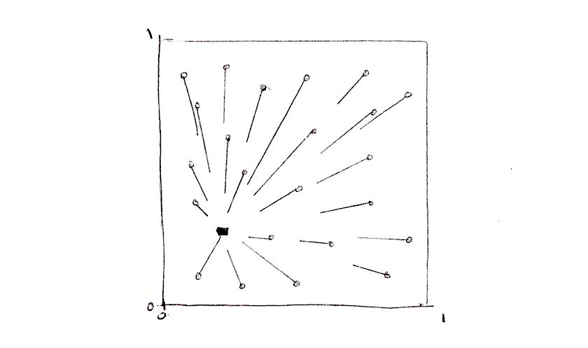

## 网格噪声（Cellular Noise）

1996 年，在原始的 Perlin Noise 发布六年后，Perlin 的 Simplex Noise 发布五年前，[Steven Worley 写了一篇名为“A Cellular Texture Basis Function”的论文](http://www.rhythmiccanvas.com/research/papers/worley.pdf). 在这篇论文里，他描述了一种现在被广泛使用的程序化纹理技术。

要理解它背后的原理，我们需要从**迭代**开始思考。你可能已经知道迭代是什么意思：对，就是使用 ```for``` 循环。在 GLSL 的 ```for``` 循环中，只有一个需要注意的：我们检查循环是否继续的次数必须是一个常数（```const```）. 所以，没有动态循环——迭代的次数必须是固定的。

网格噪声基于距离场，这里的距离是指到一个特征点集最近的点的距离。比如说我们要写一个 4 个特征点的距离场，我们应该做什么呢？**对每一个像素，计算它到最近的特征点的距离**。也就是说，我们需要遍历所有 4 个特征点，计算他们到当前像素点的距离，并把最近的那个距离存下来。 

```glsl
    float min_dist = 100.; // A variable to store the closest distance to a point

    min_dist = min(min_dist, distance(st, point_a));
    min_dist = min(min_dist, distance(st, point_b));
    min_dist = min(min_dist, distance(st, point_c));
    min_dist = min(min_dist, distance(st, point_d));
```


这种做法不是很优雅，但至少行得通。现在让我们用数组和 ```for``` 循环重写。

```glsl
    float m_dist = 100.;  // minimum distance
    for (int i = 0; i < TOTAL_POINTS; i++) {
        float dist = distance(st, points[i]);
        m_dist = min(m_dist, dist);
    }
```

注意看我们用一个 ```for``` 循环遍历特征点集的数组，用一个 [```min()```](../glossary/?search=min) 函数来获得最小距离。下面是以上想法的简要的实现：

<div class="codeAndCanvas" data="cellnoise-00.frag"></div>

上面的代码中，其中一个特征点分配给了鼠标位置。把鼠标放上去玩一玩，你可以更直观地了解上面的代码是如何运行的。然后试试：

- 你可以让其余的几个特征点也动起来吗？
- 在读完[关于形状的章节](../07/?lan=ch)后，想象一些关于距离场的有意思的用法。
- 如果你要往距离场里添加更多的特征点怎么办？如果我们想动态地添加减少特征点数怎么办？

### 平铺和迭代

你可能注意到 GLSL 对 ```for``` 循环和 *数组* 似乎不太友好。如前所说，循环不接受动态的迭代次数。还有，遍历很多实例会显著地降低着色器的性能。这意味着我们不能把这个方法用在很大的特征点集上。我们需要寻找另一个策略，一个能利用 GPU 并行架构优势的策略。



解决这个问题的一个方法是把空间分割成网格。并不需要计算每一个像素点到每一个特征点的距离，对吧？已经知道每个像素点是在自己的线程中运行，我们可以把空间分割成网格（cells），每个网格对应一个特征点。另外，为避免网格交界区域的偏差，我们需要计算像素点到相邻网格中的特征点的距离。这就是 [Steven Worley 的论文](http://www.rhythmiccanvas.com/research/papers/worley.pdf)中的主要思想。最后，每个像素点只需要计算到九个特征点的距离：他所在的网格的特征点和相邻的八个网格的特征点。我们已经在[图案](../09/?lan=ch)，[随机](../10/?lan=ch)和[噪声](../11/?lan=ch)这些章节介绍了如何把空间分割成网格，希望你已经熟悉这项技术。

```glsl
    // Scale
    st *= 3.;

    // Tile the space
    vec2 i_st = floor(st);
    vec2 f_st = fract(st);
```

那么，计划是什么呢？我们将使用网格坐标（存储在整数坐标 ```i_st``` 中）来构造特征点的随机位置。```random2f``` 函数接受一个 ```vec2``` 类型参数，返回给我们一个 ```vec2``` 类型的随机位置。所以，在每个网格内，我们有一个特征点在随机位置上。

```glsl
    vec2 point = random2(i_st);
```

网格内的每个像素点（存储在浮点坐标 ```f_st``` 中）都会计算它到那个随机点的距离。

```glsl
    vec2 diff = point - f_st;
    float dist = length(diff);
```

结果看起来就像这样：

<a href="../edit.php#12/cellnoise-01.frag"></img></a>

我们还需要计算像素点到相邻网格中随机点的距离，而不只是当前的网格。我们需要 **遍历** 所有相邻网格。不是所有网格，仅仅是那些和当前网格相邻的网格。从网格坐标来说，就是 ```x``` 坐标从 ```-1``` （左）到 ```1``` （右）， ```y``` 坐标从 ```-1``` （下）到 ```1``` （上）。一个 9 个网格的 3x3 区域可以用两个 ```for``` 循环遍历：

```glsl
for (int y= -1; y <= 1; y++) {
    for (int x= -1; x <= 1; x++) {
        // Neighbor place in the grid
        vec2 neighbor = vec2(float(x),float(y));
        ...
    }
}
```


现在，我们可以在双 ```for``` 循环中计算相邻网格中随机点的位置，只需要加上相邻网格对当前网格的偏移量。

```glsl
        ...
        // Random position from current + neighbor place in the grid
        vec2 point = random2(i_st + neighbor);
        ...
```

剩下的部分就是计算像素点到那个随机点的距离，并把最近的距离存到变量 ```m_dist```（minimum distance）里面.

```glsl
        ...
        vec2 diff = neighbor + point - f_st;

        // Distance to the point
        float dist = length(diff);

        // Keep the closer distance
        m_dist = min(m_dist, dist);
        ...
```

上面的代码源自[这篇 Inigo's Quilez 的文章](http://www.iquilezles.org/www/articles/smoothvoronoi/smoothvoronoi.htm)，他写道：

*“可能值得注意的是，在上面的代码中有一个很漂亮的技巧。多数实现都存在精度问题，因为他们是在“瑜”空间（如“世界”或“对象”空间）内产生随机点，这可能是里原点任意远的。要解决这个问题，可以使用更高精度的数据类型，或更聪明些。我的实现不是在“瑜”空间（如“世界”或“对象”空间）内产生随机点，而是在“网格”空间内：一旦提取了着色点的整数和小数部分，我们当前的网格就确定了，我们所关心的就是在这个网格周围发生了什么，意味着我们可以将所有坐标的整数部分放在一起，从而节省了许多精度位。事实上，在一个常规的 voronoi 实现中，当从着色点减去随机特征点时，点坐标的整数部分简单地消除掉了。在上面的实现中，我们甚至不会上这种消除发生，因为我们正在把所有的计算移到“网格”空间。这个技巧可以让你处理这种情况： 你想要把 voronoi 用在整个星球上——可以简单地将输入替换为双精度，执行 floor() 和 fract() 计算，其余的计算仍使用浮点数，不需要将整个实现改变成双精度的成本。当然，同样的技巧也适用于 Perlin Noise 模式（但是我还没有在任何地方看到过它的实现或记录）。”*

简要重述一遍：我们把空间分割成网格，计算每个像素点到它所在网格中的那个特征点的距离，和它到相邻的八个网格中的特征点的距离，结果是一个距离场，如下所示：

<div class="codeAndCanvas" data="cellnoise-02.frag"></div>

进一步探索:

- 缩放空间。
- 你有其它办法让那些特征点动起来吗？
- 如果我们想要加入一个鼠标位置作为其中一个特征点怎么办？
- 有没有其它办法构造这个距离场，除了 ```m_dist = min(m_dist, dist);``` 之外？
- 用这个距离场你可以创造出什么有意思的图案？

这个算法也可以从特征点而非像素点的角度理解。在那种情况下，算法可以表述为：每个特征点向外扩张生长，直到它碰到其它扩张的区域。这反映了自然界的生长规则。生命的形态是由内部扩张、生长的力量和限制性的外部力量共同决定的。模拟这种行为的算法以 [Georgy Voronoi](https://en.wikipedia.org/wiki/Georgy_Voronoy) 命名。


### Voronoi 算法

用网格噪声构造 Voronoi 图远没有看上去的那么难。我们只需要*保留*一些关于最近的特征点的额外信息。我们将要用到一个叫 ```m_point``` 的 ```vec2``` 类型变量存储像素点到最近的特征点的向量，而不只是距离。instead of just the distance, we will be "keeping" a "unique" identifier of that point.

```glsl
    ...
    if( dist < m_dist ) {
        m_dist = dist;
        m_point = point;
    }
    ...
```

注意在下面的代码中，我们不再使用 ```min``` 来计算最近距离，而是用一个普通的 ```if``` 语句。为什么？因为当一个新的更近的特征点出现的时候，我们还需要保存它的位置（32 行至 37行）。

<div class="codeAndCanvas" data="vorono-00.frag"></div>

注意那个移动的（鼠标位置下面那个）细胞的颜色是如何根据它的位置而改变的。那是因为它的颜色由最近特征点决定。

就像我们之前所做的那样，现在是扩大规模的时候，转而使用 [Steven Worley 的论文中的方法](http://www.rhythmiccanvas.com/research/papers/worley.pdf)。试着自己实现它。你可以通过点击下面的实例来获取帮助。注意 Steven Worley 的原始方法中，每个网格的特征点数是可变的，对大多数网格来说不止一个。在他的 C 语言实现中，这是用来提早退出来加速循环。GLSL 循环不允许动态的迭代次数，所以你可能更希望一个网格对应一个特征点。

<a href="../edit.php#12/vorono-01.frag"><canvas id="custom" class="canvas" data-fragment-url="vorono-01.frag"  width="520px" height="200px"></canvas></a>

一旦你弄清楚了这个算法，想想它有什么有趣、有创意的用途。


### 优化 Voronoi

在 2011 年, [Stefan Gustavson 优化了 Steven Worley 的算法](http://webstaff.itn.liu.se/~stegu/GLSL-cellular/GLSL-cellular-notes.pdf)，仅仅对一个 2x2 的矩阵作遍历（而不是 3x3 的矩阵）。这显著地减少了工作量，但是会在网格边缘制造人工痕迹。看看下面的例子。

<div class="glslGallery" data="12/2d-cnoise-2x2,12/2d-cnoise-2x2x2,12/2d-cnoise,12/3d-cnoise" data-properties="clickRun:editor,openFrameIcon:false"></div>

Later in 2012 [Inigo Quilez wrote an article on how to make precise Voronoi borders](http://www.iquilezles.org/www/articles/voronoilines/voronoilines.htm).

<a href="../edit.php#12/2d-voronoi.frag"></img></a>

Inigo 在 Voronoi 上的实验并没有就此停止。2014 年，他写了一篇非常漂亮的文章，提出一种他称作为 [voro-noise](http://www.iquilezles.org/www/articles/voronoise/voronoise.htm) 的噪声，可以让常规噪声和 voronoi 逐渐地融合。用他的话说：

*“尽管有这样的相似之处，但事实上，两种模式中网格的使用方式都是不同的。噪声会内插或平均随机值（如值噪声），而 Voronoi 是计算到最近特征点的距离。平滑双线性插值和最小值评估是两个非常不同的操作，或者……它们是否能用更广义的方法组合？如果是这样，那么噪声和 Voronoi 模式都可以被看作是一种更一般的以网格为基础的模式生成器？”*

<a href="../edit.php#12/2d-voronoise.frag"><canvas id="custom" class="canvas" data-fragment-url="2d-voronoise.frag"  width="520px" height="200px"></canvas></a>

现在，是时候仔细观察事物，去接受自然的启发，并用这项技术发现你自己的风景！


<div class="glslGallery" data="12/metaballs,12/stippling,12/cell,12/tissue,12/cracks,160504143842" data-properties="clickRun:editor,openFrameIcon:false"></div>
