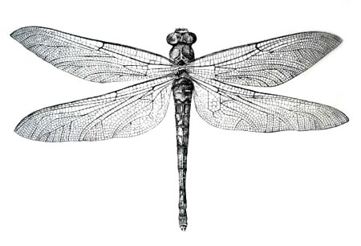
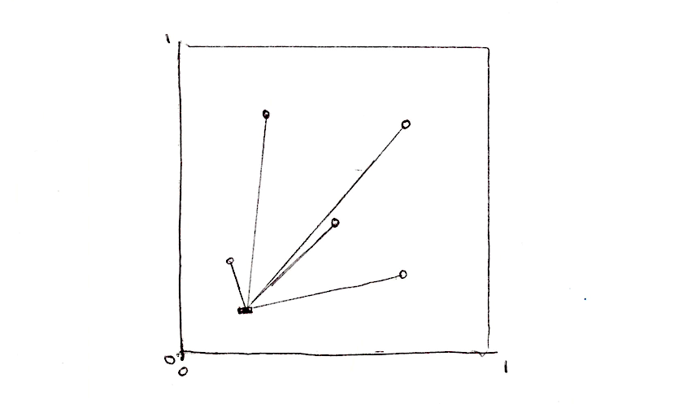
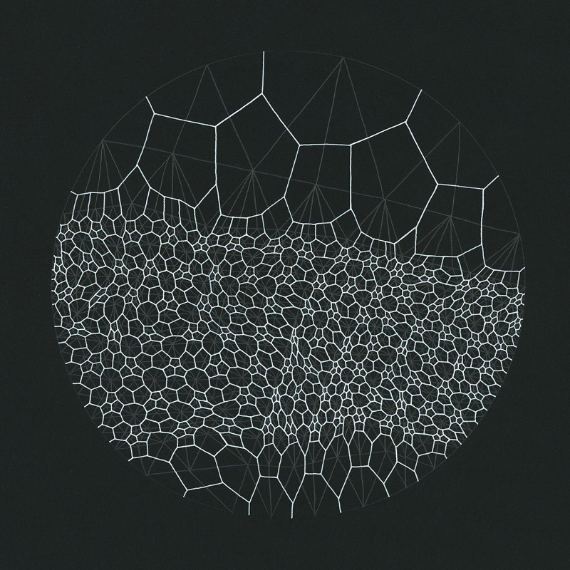
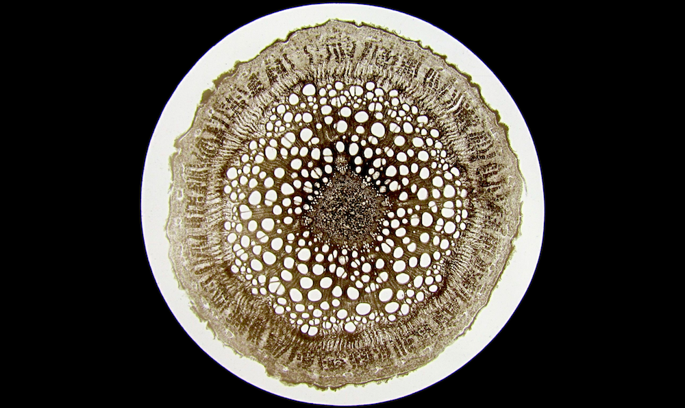

## セルラーノイズ

オリジナルのパーリンノイズから16年後、シンプレックスノイズの5年前に当たる1996年、Steven Worley は「[A Cellular Texture Basis Function](http://www.rhythmiccanvas.com/research/papers/worley.pdf)」 という論文を発表しました。この論文の中で彼は、今日のグラフィックコミュニティで幅広く使われているテクスチャリングの手法について説明しています。

背景となる原理を理解するには「繰り返し」について考える必要があります。何のことかお分かりですね。そう、 ```for``` ループです。GLSLの ```for``` ループには1つだけ難点があって、繰り返し条件として使う数値が定数（```const```）である必要があります。そのためループ回数は固定でなくてはならず、動的に変えることはできません。

まずは例を見てみましょう。

### ディスタンスフィールド上の点

セルラーノイズではディスタンスフィールドに基づいて、複数の点の中から最も近い点への距離を計算します。4つの点に対してディスタンスフィールドを作りたいとしましょう。どうすれば良いでしょうか。それぞれのピクセルについて、最も近い点への距離を計算したいですね。現在のピクセルからすべての点への距離を繰り返し計算し、最も近い点への距離を記録するようにします。

```glsl
    float min_dist = 100.; // A variable to store the closest distance to a point

    min_dist = min(min_dist, distance(st, point_a));
    min_dist = min(min_dist, distance(st, point_b));
    min_dist = min(min_dist, distance(st, point_c));
    min_dist = min(min_dist, distance(st, point_d));
```



あまりエレガントではありませんが、やりたいことは実現できています。それでは配列と ```for``` ループを使って実装し直してみましょう。

```glsl
    float m_dist = 100.;  // minimum distance
    for (int i = 0; i < TOTAL_POINTS; i++) {
        float dist = distance(st, points[i]);
        m_dist = min(m_dist, dist);
    }
```

```for``` ループを使って点の配列を繰り返し処理し、 [```min()```](../glossary/?search=min) 関数を使って最小値を記録しています。下のサンプルは実際に動作する簡単な実装例です。

<div class="codeAndCanvas" data="cellnoise-00.frag"></div>

このサンプルでは、点の1つがマウスの位置に対応しています。何が行われているか、しっかり把握できるまで試してみてください。理解できたら以下に挑戦してみましょう。

- 他の点もアニメーションさせるにはどうすれば良いでしょう。

- [形についての章](../07/)を参考に、このディスタンスフィールドを使う面白い方法について考えてみましょう。

- 点の数を増やすにはどうしますか。動的に点の数を増減したい場合はどうでしょう。

### タイリングと繰り返し

GLSLと配列、```for``` ループはあまり相性が良くないことに気づいたのではないでしょうか。先に述べた通り、繰り返しの終了条件に動的な値を使うことはできません。また、ループを途中で抜けることができず必ず最後まで実行しなくてはならないので、たくさんの点を繰り返し処理するとかなりパフォーマンスが落ちます。そのため、点の数が多い場合にはこの直接的なアプローチは使えません。GPUの並列処理を生かした別の戦略を考える必要があります。


1つの方法は空間をタイルに分割することです。すべてのピクセルについて、全ての点に対する距離をチェックする必要はありませんね。それぞれのピクセルが別々のスレッドで実行されることを考慮して、空間を格子状のタイルに分割し、それぞれのタイルに1つずつ点が含まれるようにします。これが [Steven Worleyの論文](http://www.rhythmiccanvas.com/research/papers/worley.pdf)の核になる素晴らしいアイデアです。それぞれのピクセルについて、自分自身のタイルと周囲の8つのタイルに含まれる点、9つの座標だけをチェックすれば良いのです。空間のタイル分割は既に[パターン](../09/)と[ランダム](../10/)の章で行ったので、このテクニックにはもう慣れ親しんでいることでしょう。


```glsl
    // Scale
    st *= 3.;

    // Tile the space
    vec2 i_st = floor(st);
    vec2 f_st = fract(st);
```

次はどうするのでしょうか。このタイルの座標（```i_st``` に整数座標として格納されています）を点の位置をランダムに決めるために使います。```random2``` は ```vec2``` の値を受け取りランダムな座標を ```vec2``` で返します。こうして全てのタイルについて、その中でランダムな位置を持った点が1つずつ決まります。。

```glsl
    vec2 point = random2(i_st);
```

タイルの中のそれぞれのピクセル（```f_st``` に浮動小数点座標として格納されています）について、このランダムな点までの距離を調べます。

```glsl
    vec2 diff = point - f_st;
    float dist = length(diff);
```

結果はこのようになります。

<a href="../edit.php#12/cellnoise-01.frag"></img></a>

現在のタイルだけでなく、周囲のタイルに含まれる点までの距離も調べる必要があります。そのためにタイルを繰り返し処理します。全てのタイルではなく、現在のタイルに直接隣接するものだけ、つまり ```x``` 軸の ```-1```（左）から ```1```（右）まで、```y``` 軸の ```-1```（下）から ```1```（上）までです。3×3の9つのタイルは下記のように2つの ```for``` ループを使って処理することができます。

```glsl
for (int y= -1; y <= 1; y++) {
    for (int x= -1; x <= 1; x++) {
        // Neighbor place in the grid
        vec2 neighbor = vec2(float(x),float(y));
        ...
    }
}
```


隣接するタイルの中の点の位置は、現在のタイルの座標にオフセットの値を加えることで計算できます。

```glsl
        ...
        // Random position from current + neighbor place in the grid
        vec2 point = random2(i_st + neighbor);
        ...
```

後は点までの距離を計算して、最も近いものまでの距離を変数 ```m_dist``` に記録するだけです。

```glsl
        ...
        vec2 diff = neighbor + point - f_st;

        // Distance to the point
        float dist = length(diff);

        // Keep the closer distance
        m_dist = min(m_dist, dist);
        ...
```

上のコードは[Inigo Quilezの記事](http://www.iquilezles.org/www/articles/smoothvoronoi/smoothvoronoi.htm)を参考にしました。彼はこう書いています。

>上記のコードにはうまいトリックが使われていることに触れておいた方が良いかもしれません。世にある多くの実装は計算精度の問題を抱えています。ランダムな点を（ワールド空間やオブジェクト空間のような）ドメイン空間の中で生成するため、原点から点の位置が任意の距離だけ離れている可能性があります。

（訳注：ドメイン空間 domain space — 数学的には「定義域」と訳したりしますが、ここでは分割された升目内のローカルな座標に対して、ワールド空間のようなプログラムが一般に使用する座標系を指している、くらいの解釈で良いと思います。）

>この問題はコード全体でより精度の高いデータ型を用いるようにするか、もしくは少し頭を使うことで解決できます。私の実装では点の位置をドメイン空間ではなく、升目の中の空間で生成します。シェーディングする座標の整数部分と少数部分を抜き出して、どの升目を扱っているかを特定できれば、その升目の周囲で起きることだけに気をつければ良いのです。つまり座標の整数部分をごっそり落として、その分のビットを精度を上げるために使うことができるのです。実際問題、標準的なボロノイの実装では、シェーディングする座標とランダムな点の座標の差を求める際に整数部分の値が打ち消し合うことになります。上の実装では、全ての計算を升目内の座標空間に移しているため、この打ち消し合いは発生すらしません。またこのトリックを使うと、世界を丸ごとボロノイでシェーディングするような場合も扱うことができます。入力を倍精度浮動小数点数に置き換えて ```floor()``` と ```fract()``` の計算を行いながら、他の箇所では単精度浮動小数点数を使うことで、全ての実装を倍精度に変えるコストを避けることができます。もちろん同じトリックはパーリンノイズにも使うことができます（私は実装もドキュメンテーションも見たことがありませんが）。」

要点まとめ：空間をタイルに分割します。それぞれのピクセルについて、そのピクセルを含むタイルとその周囲の8つのタイルの中にある点までの距離を計算し、最も近い点までの距離を記録します。その結果、下のサンプルのようなディスタンスフィールドが得られます。

<div class="codeAndCanvas" data="cellnoise-02.frag"></div>

もっと研究してみましょう。

- 空間を様々な値を用いて拡大縮小してください。

- 点をアニメーションさせる別の方法を考えることはできますか。

- マウスの位置を使って追加の点を加えるにはどうすれば良いでしょう。

- ```m_dist = min(m_dist, dist);``` 以外の方法でディスタンスフィールドを作る方法を考えることはできますか。

- このディスタンスフィールドを使って面白いパターンを作ることはできますか。

このアルゴリズムはピクセルではなく、点からの視点で解釈することもできます。その場合は、それぞれの点が成長して、他の点からの領域にぶつかるまで膨らんでいく、といったように言い表せます。これはある種、自然界における成長の仕組みに似ています。生きている組織はこのように、内側から広がり成長しようとする力と、外からの制約の緊張関係によって形作られます。この振る舞いをシミュレートする古典的なアルゴリズムは[Georgy Voronoi](https://en.wikipedia.org/wiki/Georgy_Voronoy)の名前をとって名付けられました。


### ボロノイアルゴリズム

ボロノイ図をセルラーノイズから作図するのは見た目よりも簡単です。現在のピクセルにどの点が最も近いかという追加の情報を記録すれば良いのです。そのために ```m_point``` という名前の ```vec2``` を使います。距離だけではなく、その点固有の識別子として座標を記録します。

```glsl
    ...
    if( dist < m_dist ) {
        m_dist = dist;
        m_point = point;
    }
    ...
```

下記のコードでは ```min``` ではなく、代わりに ```if``` が使われていることに注目してください。なぜでしょう。より近い点が見つかるたびに、その位置を記録したいからです（32-37行目）。

<div class="codeAndCanvas" data="vorono-00.frag"></div>

マウスに合わせて移動するセルの色が、位置に応じて変化していることに注目してください。色が最も近い点の値（位置）によって決められているからです。

先ほど行ったように、[Steven Worleyの論文](http://www.rhythmiccanvas.com/research/papers/worley.pdf)のアプローチに切り替えて発展させてみましょう。自分で実装できるか試してください。下記のサンプルをクリックして参考にしましょう。元々のSteven Worleyのアプローチではタイルごとに、1つだけではなく異なる数の点を使用していることに注意してください。彼のCの実装ではループから途中で抜けることで処理を速くしています。GLSLのループは中断することやループ回数を変えることができないので、点の数はタイルあたり1つのままにした方が良いでしょう。

<a href="../edit.php#12/vorono-01.frag"><canvas id="custom" class="canvas" data-fragment-url="vorono-01.frag"  width="520px" height="200px"></canvas></a>

アルゴリズムが理解できたら、創造的な面白い使い方を考えてみましょう。





### ボロノイを改善する

2011年にStefan GustavsonはSteven Worleyのアルゴリズムを、3×3ではなく2×2の繰り返し処理を用いて[GPU向けに最適化](http://webstaff.itn.liu.se/~stegu/GLSL-cellular/GLSL-cellular-notes.pdf)しました。これにより処理量は大きく減りますが、代わりにタイルの端にうまく繋がらない部分ができることがあります。以下の例をご覧ください。

<div class="glslGallery" data="12/2d-cnoise-2x2,12/2d-cnoise-2x2x2,12/2d-cnoise,12/3d-cnoise" data-properties="clickRun:editor,openFrameIcon:false"></div>

2012年にはInigo Quilezが[ボロノイの輪郭線を正確に描く方法についての記事](http://www.iquilezles.org/www/articles/voronoilines/voronoilines.htm)を書きました。

<a href="../edit.php#12/2d-voronoi.frag"></img></a>

Inigoのボロノイについての実験は続きます。2014年には彼が[voro-noise](http://www.iquilezles.org/www/articles/voronoise/voronoise.htm)と呼ぶ、標準的なノイズとボロノイを徐々にブレンドできる関数についての記事を書きました。

>似てはいるものの、グリッドが両方のパターンで使われる方法は異なります。ノイズはランダムな値を（バリューノイズのように）補完や平均、もしくは（グラデーションノイズのように）平滑にしますが、ボロノイは最も近い特徴点への距離を計算します。スムースなバイリニア補完と最小値の評価は全く違う処理です。いや、本当にそうでしょうか。この2つをもっと一般化された形で組み合わせることはできないのでしょうか。もしできるならノイズとボロノイ図は、グリッドに基づくより一般的なパターン生成方法の特殊な例とみなせるのではないでしょうか。

<a href="../edit.php#12/2d-voronoise.frag"><canvas id="custom" class="canvas" data-fragment-url="2d-voronoise.frag"  width="520px" height="200px"></canvas></a>

さて、今度はあなたの番です。物事をよく観察して、自然からのインスピレーションを得ましょう。そしてこのテクニックをあなた自身のやり方で応用してみましょう。



<div class="glslGallery" data="12/metaballs,12/stippling,12/cell,12/tissue,12/cracks,160504143842" data-properties="clickRun:editor,openFrameIcon:false"></div>
