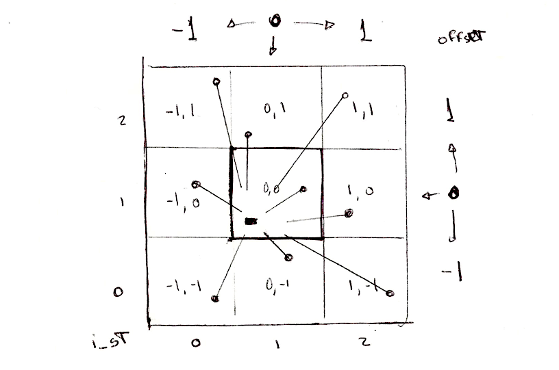
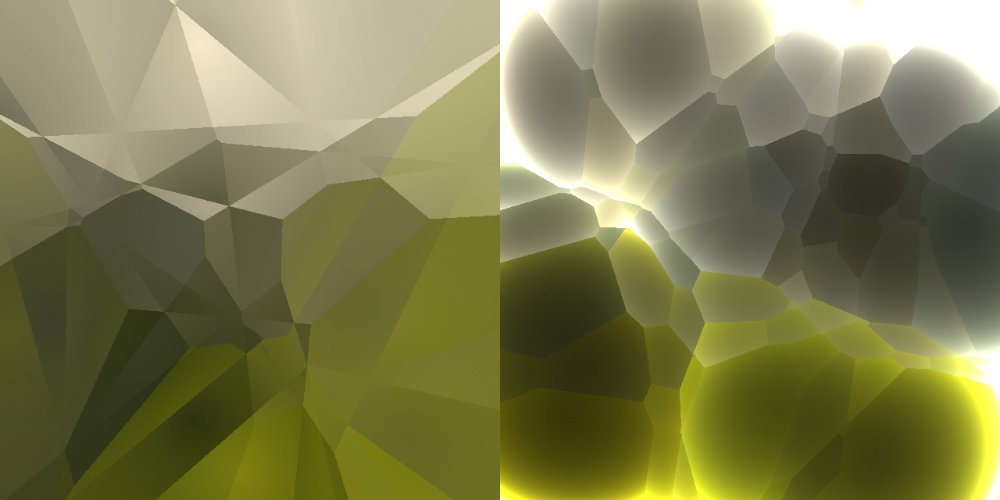
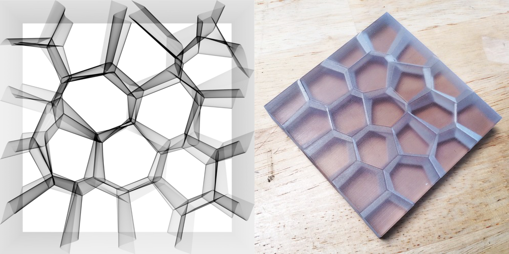

## Клеточный шум

В 1996 году, через 16 лет после изобретения оригинального шума Перлина и за 5 лет до появления симплексного шума, Стивен Ворли написал статью под названием [«Базисная функция для клеточной текстуры»](http://www.rhythmiccanvas.com/research/papers/worley.pdf). В этой статье он описывает способ процедурного текстурирования, который теперь активно используется графическим сообществом.

Чтобы понять лежащие в основе этого способа принципы, нам нужно научиться думать в терминах **итераций**. Вы наверное уже догадались к чему это приведёт: нам придётся использовать цикл ```for```. Особенность цикла ```for``` в GLSL заключается в том, что число, с которым мы сравниваем счётчик, должно быть константой (```const```). Поэтому никаких динамических циклов - количество итераций должно быть фиксировано.

Давайте рассмотрим пример.

### Точки в поле расстояний

Клеточный шум основан на поле расстояний до ближайшей из множества опорных точек. Представим, что мы делаем поле расстояний на четырёх точках. Чтор нужно сделать? **Для каждого пикселя нужно посчитать расстояние до ближайшей точки**. Это значит, что нам нужно пройти по всем точкам, рассчитать расстояние до каждой из них и сохранить расстояние до ближайшей.

```glsl
    float min_dist = 100.; // Переменная под расстояние до ближайшей точки.

    min_dist = min(min_dist, distance(st, point_a));
    min_dist = min(min_dist, distance(st, point_b));
    min_dist = min(min_dist, distance(st, point_c));
    min_dist = min(min_dist, distance(st, point_d));
```


Не самый красивый код, но он делает свою работу. Теперь давайте перепишем его с использованием массива и цикла ```for```.

```glsl
    float m_dist = 100.;  // минимальное расстояние
    for (int i = 0; i < TOTAL_POINTS; i++) {
        float dist = distance(st, points[i]);
        m_dist = min(m_dist, dist);
    }
```

Обратите внимание на то, как мы используем ```for``` для обхода массива точек и функцию [```min()```](../glossary/?search=min) для сохранения минимального расстояния. Вот краткая рабочая реализация этой идеи:

<div class="codeAndCanvas" data="cellnoise-00.frag"></div>

В этом коде одна из точек выбирается в соответствии с положением курсора мыши. Поиграйте с примером, чтобы интуитивно понять как работает этот код. Затем попробуйте выполнить следующее:

- Как бы вы анимировали остальные точки?
- После прочтения [главы о фигурах](../07/?lan=ru), придумайте интересные применения этому полю расстояний!
- Как добавить больше точек к полю расстояний? А что если мы захотим динамически добавлять и удалять точки?

### Замощение и итерации

Вы скорее всего заметили, что циклы ```for``` и массивы не очень дружат с GLSL. Как было сказано ранее, циклы не принимают динамического количества итераций в условии прекращения. Так же, большое количество итераций сильно бьёт по производительности. Это значит, что мы не можем использовать реализацию «в лоб» для большого количества точек. Нужно найти такую стратегию, которая использовала бы преимущества параллельной архитектуры GPU.


Один из подходов к этой проблеме использует разделение пространства на непересекающиеся элементы, то есть замощение. Каждому пикселю не обязательно проверять расстояние до абсолютно всех точек, правда? Зная, что каждый пиксель работает в отдельном потоке, мы можем разделить пространство на клетки, в каждой из которых нужно будет просмотреть только одну точку. Так же, чтобы избежать артефактов на границах клеток, нужно проверять расстояния до точек в соседних клетках. Это и есть основная идея [работы Стивена Ворли](http://www.rhythmiccanvas.com/research/papers/worley.pdf). В итоге, каждому пикселю достаточно проверить всего девять точек: точку в своей собственной клетке и в восьми клетках вокруг неё. Мы уже разбивали пространство в главах об [узорах](../09/?lan=ru), [беспорядке](../10/?lan=ru) и [шуме](../11/?lan=ru), а значит эта методика уже должна быть вам хорошо знакома.

```glsl
    // Масштаб
    st *= 3.;

    // Разбиение пространства
    vec2 i_st = floor(st);
    vec2 f_st = fract(st);
```

Каков же наш план? Мы воспользуемся координатой клетки (целая часть координат, ```i_st```) для построения случайной координаты точки. Функция ```random2f``` принимает ```vec2``` и возвращает ```vec2``` со случайными координатами. Итак, в каждой клетке у нас будет одна опорная точка со случайной координатой внутри клетки.

```glsl
    vec2 point = random2(i_st);
```

Каждый пиксель в клетке (его координаты в пределах клетки хранятся в ```f_st```) проверит расстояние до этой случайной точки.

```glsl
    vec2 diff = point - f_st;
    float dist = length(diff);
```

Результат выглядит примерно так:

<a href="../edit.php#12/cellnoise-01.frag"></img></a>

Нам всё ещё нужно проверить расстояние до точек в окружающих клетках, а не только в своей собственной. Для этого мы **обойдём** циклом все соседние клетки. Не все клетки, а только те, что непосредственно прилегают к данной. То есть от ```-1``` (левой) до ```1``` (правой) клетки по оси ```x``` и от ```-1``` (нижней) до ```1``` (верхней) клетки по оси ```y```. Этот регион из девяти клеток можно обойти следующим циклом ```for```:

```glsl
for (int y= -1; y <= 1; y++) {
    for (int x= -1; x <= 1; x++) {
        // Соседняя клетка
        vec2 neighbor = vec2(float(x),float(y));
        ...
    }
}
```



Теперь во вложенном цикле мы можем вычислить положение опорной точки в каждой из соседних клеток, прибавляя смещение соседней клетки к координатам текущей.

```glsl
        ...
        // Случайное положение в зависимости от координат текущей клетки + смещение
        vec2 point = random2(i_st + neighbor);
        ...
```

Остаётся только вычислить расстояние до каждой из точек и сохранить минимальное в переменной ```m_dist```.

```glsl
        ...
        vec2 diff = neighbor + point - f_st;

        // Расстояние до точки
        float dist = length(diff);

        // Сохранить наименьшее расстояние
        m_dist = min(m_dist, dist);
        ...
```

Этот код навеян следующим отрывком из [статьи Иниго Квилеза](http://www.iquilezles.org/www/articles/smoothvoronoi/smoothvoronoi.htm):

*«... стоит обратить внимание на красивый трюк в коде выше. Большинство реализаций страдают потерей точности потому что они генерируют случайные точки в «глобальном» пространстве («мировом» или «пространстве объекта»), а значит эти точки могут быть сколь угодно далеко от начала координат. Проблему можно решить, пересадив весь код на более высокоточный тип данных, или просто немного подумав. Моя реализация генерирует точки не в "мировом" пространстве, а в пространстве клетки: как только координата пикселя разделена на целую и дробную части, а значит каждой клетке назначены свои координаты, мы можем размышлять только о происходящем внутри клетки, то есть отбросить целую часть координаты пикселя и сберечь несколько бит точности. Фактически, в наивной реализации диаграмм Вороного целые части координат точек взаимно уничтожаются при вычитании опорной точки из текущей точки. В реализации выше мы предотвращаем взаимное уничтожение, перенося все вычисления в пространство клетки. Этот подход позволяет текстурировать диаграммой Вороного хоть целую планету, если увеличить точность входных координат до двойной, вычислить floor() и fract(), а затем перейти к одинарной точности, не тратя вычислительные ресурсы на перевод всего алгоритма на двойную точность. Разумеется, аналогичный трюк применим и к шумам Перлина (но я не видел ни описания ни реализации подобного алгоритма).»*

Резюмируя: разбиваем пространство на клетки. Каждый пиксель вычисляет расстояние до точки в своей клетке и в окружающих восьми клетках, сохраняет кратчайшее из них. Получается поле расстояний, выглядящее примерно так:

<div class="codeAndCanvas" data="cellnoise-02.frag"></div>

Исследуйте его, выполнив следующее:

- Масштабируйте пространство на различную величину.
- Придумайте другие способы анимировать точки.
- Что если мы захотим добавить точку в координатах мыши?
- Какие ещё способы создания поля расстояний вы можете предложить, кроме ```m_dist = min(m_dist, dist);```?
- Какие интересные узоры можно создать с помощью этого поля расстояний?

Этот алгоритм можно так же реализовать, отталкиваясь от точек, а не от пикселей. В этом случае его можно описать так: каждая точка растёт пока не встретится с растущей областью другой точки. Примеры подобного роста есть в природе. Некоторые живые организмы принимают свою форму благодаря разности между внутренними силами, направленными на рост и расширение, и внешними ограничивающими силами. Классический алгоритм, симулирующий такое поведение, назван в честь [Георгия Вороного](https://ru.wikipedia.org/wiki/%D0%92%D0%BE%D1%80%D0%BE%D0%BD%D0%BE%D0%B9,_%D0%93%D0%B5%D0%BE%D1%80%D0%B3%D0%B8%D0%B9_%D0%A4%D0%B5%D0%BE%D0%B4%D0%BE%D1%81%D1%8C%D0%B5%D0%B2%D0%B8%D1%87).


### Алгоритм Вороного

Конструирование диаграмм Вороного из клеточного шума не настолько сложно, как может показаться. Нужно всего лишь *сохранить* некоторую дополнительную информацию о ближайшей к пикселю точке. Для этого мы воспользуемся переменной ```m_point``` типа ```vec2```. Сохраняя вектор направления на точку вместо расстояния, мы сохраним «уникальный» идентификатор этой точки.

```glsl
    ...
    if( dist < m_dist ) {
        m_dist = dist;
        m_point = point;
    }
    ...
```

Обратите внимание, что в следующем коде мы используем обычный ```if``` вместо ```min``` для сохранения минимального расстояния. Почему? Потому что мы хотим совершить дополнительные действия при нахождении новой ближайшей точки, а именно, сохранить её координаты (строки 32 - 37).

<div class="codeAndCanvas" data="vorono-00.frag"></div>

Обратите внимание как цвет движущейся клетки (привязанной к координатам мыши) изменяется в зависимости от положения. Так происходит потому, что цвет вычисляется на основе координат ближайшей точки.

Как и в предыдущих примерах, теперь настало время увеличить масштабы, использовав подход из [работы Стивена Ворли](http://www.rhythmiccanvas.com/research/papers/worley.pdf). Попробуйте реализовать его самостоятельно. В качестве подсказки используйте следующий пример, кликнув на него. Обратите внимание, что в оригинальной работе Ворли использует более чем одну точку на клетку, и их количество может изменяться. В его программной реализации на языке C это помогает ускорить вычисления благодаря раннему выходу из циклов. Циклы в GLSL не позволяют переменного количества итераций, поэтому вам скорее всего придётся использовать одну опорную точку на клетку.

<a href="../edit.php#12/vorono-01.frag"><canvas id="custom" class="canvas" data-fragment-url="vorono-01.frag"  width="520px" height="200px"></canvas></a>

Придумайте интересные и творческие применения для этого алгоритма, как только освоите его.






### Совершенствуем диаграммы Вороного

В 2011 году [Стефан Густавсон оптимизировал алгоритм Ворли для GPU](http://webstaff.itn.liu.se/~stegu/GLSL-cellular/GLSL-cellular-notes.pdf), обходя только матрицы 2х2 вместо 3х3. Это существенно уменьшает объём вычислений, но может давать артефакты в виде резких переходов на границах между клетками. Посмотрите на следующий пример.

<div class="glslGallery" data="12/2d-cnoise-2x2,12/2d-cnoise-2x2x2,12/2d-cnoise,12/3d-cnoise" data-properties="clickRun:editor,openFrameIcon:false"></div>

Позже, в 2012 году, [Иниго Квилез написал статью о создании точных границ ячеек диаграммы Вороного](http://www.iquilezles.org/www/articles/voronoilines/voronoilines.htm).

<a href="../edit.php#12/2d-voronoi.frag"></img></a>

Эксперименты Иниго над диаграммами Вороного на этом не закончились. В 2014 он написал статью о функции, которую он назвал [шумом Вороного](http://www.iquilezles.org/www/articles/voronoise/voronoise.htm) (англ. voro-noise). Эта функция осуществляет постепенный переход от обычного шума к диаграмме Вороного. Цитата:

*«Несмотря на внешнюю схожесть, решётка в этих паттернах используется по разному. Шум усредняет или интерполирует случайные значения (в обычном шуме) или градиенты (в градиентном шуме), в то время как алгоритм Вороного вычисляет расстояния до ближайших опорных точек. Гладкая билинейная интерполяция и вычисление минимума - очень разные операции... Но так ли это? Могут ли они быть скомбинированны в более общей метрике? Если бы это было так, то обычный шум и диаграммы Вороного можно было бы рассматривать как частные случаи более общего алгоритма генерации узоров на регулярной решётке.»*

<a href="../edit.php#12/2d-voronoise.frag"><canvas id="custom" class="canvas" data-fragment-url="2d-voronoise.frag"  width="520px" height="200px"></canvas></a>

Настало время оглянуться вокруг, вдохновиться природой и попробовать собственные силы в этой технике!


<div class="glslGallery" data="12/metaballs,12/stippling,12/cell,12/tissue,12/cracks,160504143842" data-properties="clickRun:editor,openFrameIcon:false"></div>
