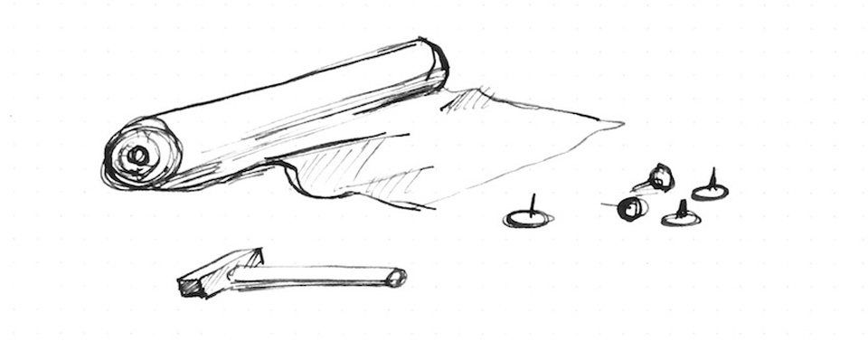
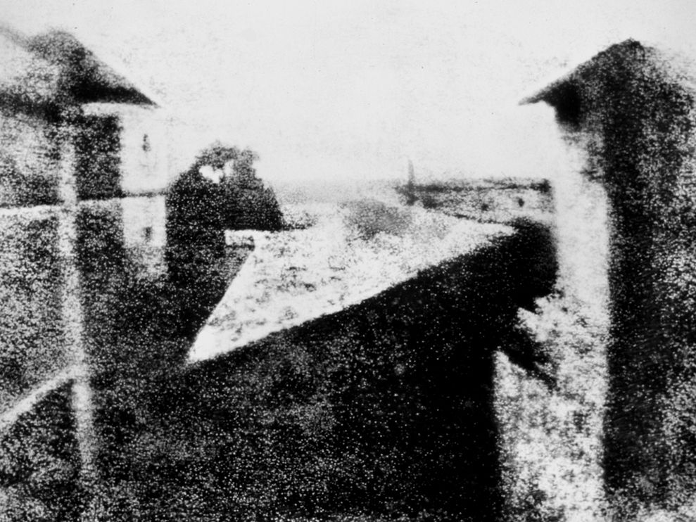
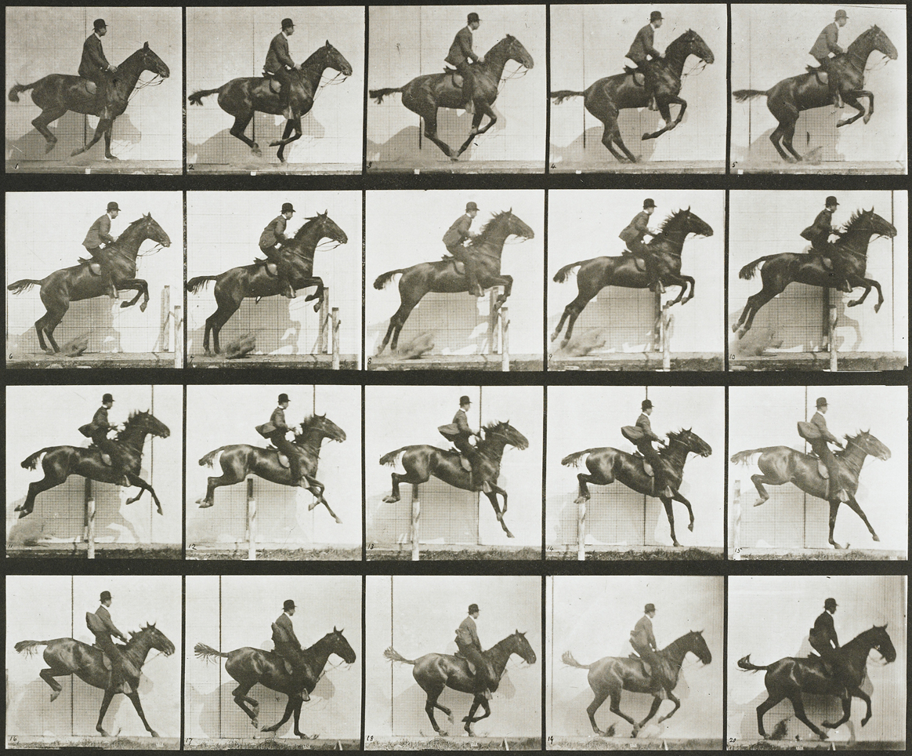

# Image processing

## Textures



Graphic cards (GPUs) have special memory types for images. Usually on CPUs images are stores as arrays of bites but on GPUs store images as ```sampler2D``` which is more like a table (or matrix) of floating point vectors. More interestingly is that the values of this *table* of vectors are continously. That means that value between pixels are interpolated in a low level.

In order to use this feature we first need to *upload* the image from the CPU to the GPU, to then pass the ```id``` of the texture to the right [```uniform```](../05). All that happens outside the shader. 

Once the texture is loaded and linked to a valid ```uniform sampler2D``` you can ask for specific color value at specific coordinates (formated on a [```vec2```](index.html#vec2.md) variable) usin the [```texture2D()```](index.html#texture2D.md) function which will return a color formated on a [```vec4```](index.html#vec4.md) variable.

```glsl
vec4 texture2D(sampler2D texture, vec2 coordinates)  
```

Check the following code where we load Hokusai's Wave (1830) as ```uniform sampler2D u_tex0``` and we call every pixel of it inside the billboard:

<div class="codeAndCanvas" data="texture.frag" data-textures="hokusai.jpg"></div>

If you pay attention you will note that the coordinates for the texture are normalized! What a surprise right? Textures coordenates are consisten with the rest of the things we had saw and their coordenates are between 0.0 and 1.0 whitch match perfectly with the normalized space coordinates we have been using. 

Now that you have seen how we load correctly a texture is time to experiment to discover what we can do with it, by trying:

* Scaling the previus texture by half.
* Rotating the previus texture 90 degrees.
* Hooking the mouse position to the coordenates to move it.

Why you should be excited about textures? Well first of all forget about the sad 255 values for channel, once your image is trasformed into a ```uniform sampler2D``` you have all the values between 0.0 and 1.0 (depending on what you set the ```precision``` to ). That's why shaders can make really beatiful post-processing effects. 

Second, the [```vec2()```](index.html#vec2.md) means you can get values even between pixels. As we said before the textures are a continum. This means that if you set up your texture correctly you can ask for values all arround the surface of your image and the values will smoothly vary from pixel to pixel with no jumps! 

Finnally, you can setup your image to repeat in the edges, so if you give values over or lower of the normalized 0.0 and 1.0, the values will wrap around starting over.

All this features makes your images more like an infinit spandex fabric. You can streach and shrinks your texture without noticing the grid of bites they originally where compose of or the ends of it. To experience this take a look to the following code where we distort a texture using [the noise function we already made](../11/).

<div class="codeAndCanvas" data="texture-noise.frag" data-textures="hokusai.jpg"></div>

## Texture resolution

Aboves examples play well with squared images, where both sides are equal and match our squared billboard. But for non-squared images things can be a little more tricky, and unfortunatly centuries of picturical art and photography found more pleasent to the eye non-squared proportions for images.



How we can solve this problem? Well we need to know the original proportions of the image to know how to streatch the texture correctly in order to have the original [*aspect ratio*](http://en.wikipedia.org/wiki/Aspect_ratio). For that the texture width and height is pass to the shader as an ```uniform```. Which in our example framework are pass as an ```uniform vec2``` with the same name of the texture followed with proposition ```Resolution```. Once we have this information on the shader he can get the aspect ration by dividing the ```width``` for the ```height``` of the texture resolution. Finally by multiplying this ratio to the coordinates on ```y``` we will shrink these axis to match the original proportions.

Uncomment line 21 of the following code to see this in action.

<div class="codeAndCanvas" data="texture-resolution.frag" data-textures="nicephore.jpg"></div>

* What we need to do to center this image?

## Digital upholstery


You may be thinking that this is unnesesary complicated... and you are probably right. Also this way of working with images leave a enought room to different hacks and creative tricks. Try to imagine that you are an upholster and by streaching and folding a fabric over a structure you can create better and new patterns and techniques. 



This level of craftsmanship links back to some of the first optical experiments ever made. For example on games *sprite animations* are very common, and is inevitably to see on it reminicence to phenakistoscope, zoetrope and praxinoscope.

This could seam simple but the posibilities of modifing textures coordinates is enormus. For example: .

<div class="codeAndCanvas" data="texture-sprite.frag" data-textures="muybridge.jpg"></div>

Now is your turn:

* Can you make a kaleidoscope using what we have learn?

* Way before Oculus or google cardboard, stereoscopic photography was a big thing. Could code a simple shader to re-use this beautiful images?

<a href=“../edit.php#10/ikeda-03.frag”><canvas id=“custom” class=“canvas” data-fragment-url=“ikeda-03.frag”  width=“520px” height=“200px”></canvas></a>


* What other optical toys can you re-create using textures?

In the next chapters we will learn how to do some image processing using shaders. You will note that finnaly the complexity of shader makes sense, because was in a big sense designed to do this type of process. We will start doing some image operations!